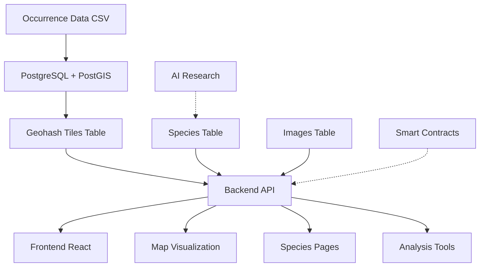
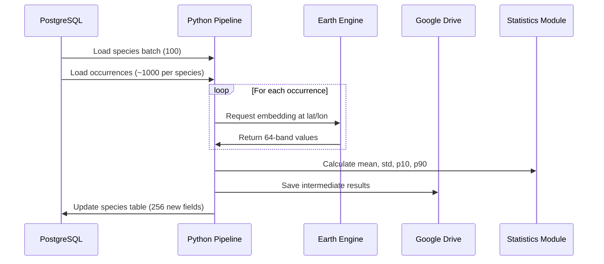

# Treekipedia Comprehensive Assessment & Google Earth Engine Integration Strategy

**Date**: October 26, 2025
**Version**: 1.0
**Author**: AI Architecture Assessment Team

---

## Executive Summary

Treekipedia has evolved from its conceptual vision into a functional platform with substantial infrastructure in place. The repository contains a sophisticated multi-tier architecture combining a Next.js 15 frontend, Express.js backend with PostGIS spatial capabilities, and PostgreSQL database with 67,743 species records and 5.7M geohash tiles. While the core platform is operational, significant gaps exist between the documented vision and actual implementation, particularly in AI research capabilities, blockchain integration, and advanced ecological modeling.

This assessment identifies these gaps and presents a comprehensive strategy for integrating Google Earth Engine's AlphaEarth embeddings to extract species-level environmental signatures. The proposed pipeline will process 67,743 species using their occurrence data to generate 256 new knowledge fields per species (mean, std dev, 10th, and 90th percentiles across 64 embedding bands), enabling advanced ecological AI applications.

---

## 1. Current Capabilities Inventory

### 1.1 Frontend Features (Next.js 15.2.3 + React 18.3.1)

**Implemented Components:**
- **Species Pages**: Basic listing and detail views at `/species/[taxon_id]`
- **Interactive Analysis Map**: Leaflet-based mapping with polygon drawing capabilities
- **Heatmap Visualization**: Using leaflet.heat for occurrence density
- **Admin Dashboard**: Located at `/app/admin/` with multiple sub-modules
- **Treederboard**: User leaderboard system for contributions
- **Search Interface**: Basic species search functionality

**Technology Stack:**
```json
{
  "framework": "Next.js 15.2.3",
  "ui": "Tailwind CSS 3.4.1",
  "state": "@tanstack/react-query 5.69.0",
  "maps": "leaflet 1.9.4 + react-leaflet 5.0.0",
  "blockchain": "wagmi 2.14.15 + viem 2.24.2 + ethers 6.13.5"
}
```

**Key Gaps:**
- Species detail tabs (Overview, Geographic, Ecological, Physical, Stewardship) not fully implemented
- Research funding card component missing
- AI vs human data distinction UI not complete
- Blockchain wallet connection not integrated

### 1.2 Backend API Endpoints (Express.js 4.21.2)

**Operational Endpoints:**

```javascript
// Species Endpoints
GET /species                    // Search with broken implementation (schema mismatch)
GET /species/suggest            // Autocomplete functionality
GET /species/:taxon_id          // Species details (115 fields)
GET /species/:taxon_id/images   // Species images

// Geospatial Endpoints (PostGIS-powered)
GET /api/geospatial/species/:taxon_id/distribution  // Distribution map
GET /api/geospatial/tiles/:geohash                  // Species in geohash
GET /api/geospatial/tiles                           // STAC-compliant temporal query
GET /api/geospatial/stats                           // Spatial statistics
GET /api/geospatial/species-nearby                  // Find species near location
GET /api/geospatial/occurrence-heatmap              // Heatmap for bounding box

// Admin Endpoints (New Discovery)
GET /admin/sheets/sync          // Google Sheets synchronization
GET /admin/monitor/status       // System monitoring
POST /admin/upload/csv          // CSV data import

// Research & Sponsorship (Partially Implemented)
GET /research/research/:taxon_id         // Get research data
GET /sponsorships/transaction/:hash      // Check payment status
POST /sponsorships/webhook               // Infura payment webhook

// User Management
GET /treederboard                        // Leaderboard
GET /treederboard/user/:wallet_address   // User profile
PUT /treederboard/user/profile           // Update display name
```

**Critical Bug Identified:**
```javascript
// File: controllers/species.js line ~25
// Issue: Queries non-existent column "species"
// Should use: "species_scientific_name" or "accepted_scientific_name"
```

### 1.3 Database Schema (PostgreSQL 17 + PostGIS 3.6)

**Core Tables:**

```sql
-- 1. species (67,743 records)
- 115 columns including dual AI/human fields
- Taxonomic: taxon_id, species_scientific_name, family, genus
- Ecological: habitat, elevation_ranges, conservation_status
- Physical: growth_form, leaf_type, maximum_height
- Geographic: countries_native, ecoregions
- Tracking: researched (boolean), verification_status

-- 2. geohash_species_tiles (5,786,835 records)
- STAC-compliant spatial data
- Level 7 geohash tiles (~150m resolution)
- JSONB species_data: {"taxon_id": count}
- PostGIS geometry and indexing

-- 3. images (30,000+ Wikimedia Commons)
- Proper attribution and licensing
- One primary image per species

-- 4. users, contreebution_nfts, sponsorships
- Blockchain integration tables (partially used)

-- Additional Tables (discovered)
- ecoregions (847 polygons)
- intact_forest_landscapes (6,819 polygons)
```

**Geospatial Capabilities:**
- PostGIS 3.6.0 fully operational
- Spatial indexes on geometry columns
- STAC-compliant temporal queries
- Geohash-based tile system for efficient queries

### 1.4 Smart Contract Integration

**Discovered Contracts:**
- `ResearchSponsorshipPayment.sol`: USDC payment handling
- `ContreebutionNFT.sol`: ERC-721 NFT minting

**Status**: Contracts deployed but not integrated with frontend; backend webhook endpoints exist but are not fully connected.

---

## 2. Architecture Analysis

### 2.1 Data Flow Diagram



### 2.2 Technology Stack Evaluation

**Strengths:**
- Modern, scalable architecture with Next.js 15 and Express
- PostGIS integration enables sophisticated spatial queries
- STAC-compliant geospatial data structure
- Efficient geohash tiling system for 5.7M tiles

**Weaknesses:**
- No AI research pipeline implemented
- Blockchain integration incomplete
- Missing Apache Jena graph database (still on PostgreSQL)
- No Google Earth Engine integration
- Python microservice exists but disconnected from main system

### 2.3 Performance Considerations

**Database Performance:**
- 67,743 species records: Manageable
- 5,786,835 geohash tiles: Well-indexed with PostGIS
- Spatial queries optimized with GIST indexes

**API Performance:**
- Need caching layer for expensive queries
- Missing rate limiting implementation
- No query optimization for complex joins

---

## 3. Vision vs Reality Gap Analysis

### 3.1 Features Documented vs Implemented

| Feature | Documented | Implemented | Status |
|---------|------------|-------------|--------|
| Species Knowledge Graph | ✅ 115 fields | ✅ Database schema | ✅ Complete |
| Geospatial Analysis | ✅ PostGIS + Geohashing | ✅ Functional | ✅ Complete |
| AI Research Agents | ✅ Extensive docs | ❌ Not implemented | 🔴 Critical Gap |
| Blockchain Integration | ✅ Smart contracts | ⚠️ Partial | 🟡 Incomplete |
| Apache Jena Migration | ✅ Planned | ❌ Not started | 🔴 Not Started |
| On-Demand Recommendations | ✅ Designed | ⚠️ Basic only | 🟡 Partial |
| EAS Attestations | ✅ Planned | ❌ Not implemented | 🔴 Missing |
| IPFS Integration | ✅ Documented | ❌ Not implemented | 🔴 Missing |

### 3.2 Data Model Completeness

**Implemented:**
- Core species taxonomy (complete)
- Geographic distribution (complete)
- Geohash occurrence tiles (complete)
- Basic image support (30,000+ images)

**Missing:**
- AI-generated research fields (empty)
- Ecological embeddings (not started)
- Temporal species data (limited)
- Allometric models (empty fields)

---

## 4. Google Earth Engine Integration Strategy

### 4.1 GEE Capabilities Overview

**AlphaEarth Embeddings (GOOGLE/SATELLITE_EMBEDDING/V1/ANNUAL):**
- 64-dimensional embedding vectors per 10m pixel
- Available 2017-2024 annually
- Encodes temporal surface conditions
- Bands labeled A01-A64

**API Access:**
```javascript
var embeddings = ee.ImageCollection('GOOGLE/SATELLITE_EMBEDDING/V1/ANNUAL')
  .filterDate('2024-01-01', '2025-01-01')
  .filterBounds(point)
  .first();
```

### 4.2 Quota Management Strategies

**GEE Quotas:**
- Interactive requests: 5-minute timeout, tens of MB limit
- Batch processing: 10-day maximum task lifetime
- Concurrent requests: Project-specific limits
- Asset storage: 250 GB, 10,000 assets default

**Optimization Strategies:**
1. Use batch exports to Google Drive for large extractions
2. Process species in chunks of 100-500
3. Cache extracted embeddings locally
4. Implement exponential backoff for rate limits
5. Use reduceRegions for efficient multi-point extraction

### 4.3 Pipeline Architecture Design

```python
class SpeciesEmbeddingPipeline:
    """
    Extracts AlphaEarth embeddings for species occurrences
    Generates 256 statistical fields per species
    """

    def __init__(self):
        self.ee_initialized = False
        self.drive_folder = 'treekipedia_embeddings'
        self.batch_size = 500  # occurrences per batch
        self.species_chunk_size = 100  # species per processing run

    def process_species(self, taxon_id, occurrences):
        """
        Extract embeddings for all occurrences of a species
        Returns: mean, std, p10, p90 for each of 64 bands
        """
        # Temporal logic
        embeddings = []
        for occ in occurrences:
            year = self.get_embedding_year(occ.year)
            point = ee.Geometry.Point([occ.lng, occ.lat])
            embedding = self.extract_embedding(point, year)
            embeddings.append(embedding)

        # Calculate statistics
        return self.calculate_statistics(embeddings)

    def get_embedding_year(self, occurrence_year):
        """Temporal matching logic"""
        if occurrence_year <= 2018:
            return 2018
        elif occurrence_year > 2024:
            return 2024
        else:
            return occurrence_year
```

### 4.4 Storage/Caching Strategy (Google Drive)

**Architecture:**
```
Google Drive/
└── treekipedia_embeddings/
    ├── raw_extractions/
    │   ├── species_batch_001/
    │   │   ├── taxon_001_embeddings.csv
    │   │   └── taxon_002_embeddings.csv
    │   └── species_batch_002/
    ├── aggregated_stats/
    │   ├── batch_001_stats.parquet
    │   └── batch_002_stats.parquet
    └── checkpoint/
        └── processing_status.json
```

**Benefits:**
- Minimal local storage (< 5GB)
- Resume capability after failures
- Shareable intermediate results
- Free 15GB storage per Google account

---

## 5. Species Embedding Extraction Pipeline

### 5.1 Detailed Technical Design

```python
# Complete Pipeline Architecture
class TreekipediaEmbeddingExtractor:

    def __init__(self, config):
        self.db_conn = psycopg2.connect(config['database_url'])
        self.ee_service_account = config['ee_service_account']
        self.drive_service = self.init_drive_service()

    def run_full_extraction(self):
        """Main extraction pipeline"""

        # Phase 1: Load species and occurrences
        species_list = self.load_species_list()  # 67,743 species

        # Phase 2: Process in chunks
        for chunk in self.chunk_species(species_list, size=100):

            # Load occurrences for chunk
            occurrences = self.load_occurrences_batch(chunk)

            # Extract embeddings via GEE
            embeddings = self.extract_embeddings_batch(occurrences)

            # Calculate statistics
            stats = self.calculate_species_statistics(embeddings)

            # Save to Google Drive
            self.save_to_drive(stats, chunk.batch_id)

            # Update database with new fields
            self.update_species_embeddings(stats)

            # Checkpoint progress
            self.save_checkpoint(chunk.batch_id)
```

### 5.2 Data Flow from Occurrence → Embedding → Aggregation → Storage



### 5.3 Temporal Matching Logic Implementation

```python
def match_occurrence_to_embedding_year(occurrence_year):
    """
    Implements temporal logic for embedding selection

    Rules:
    - Occurrences ≤2018: Use 2018 (first AlphaEarth year)
    - Occurrences 2019-2024: Use occurrence year
    - Occurrences >2024: Use 2024 (latest available)
    """
    FIRST_EMBEDDING_YEAR = 2018
    LAST_EMBEDDING_YEAR = 2024

    if occurrence_year <= FIRST_EMBEDDING_YEAR:
        return FIRST_EMBEDDING_YEAR
    elif occurrence_year > LAST_EMBEDDING_YEAR:
        return LAST_EMBEDDING_YEAR
    else:
        return occurrence_year
```

### 5.4 Chunking and Batch Processing Strategy

**Hierarchical Chunking:**
```python
# Level 1: Species chunks (100 species)
species_chunks = chunk_species(all_species, chunk_size=100)

# Level 2: Occurrence batches (500 points per GEE request)
for species in species_chunk:
    occurrence_batches = chunk_occurrences(species.occurrences, batch_size=500)

    # Level 3: Temporal grouping (same year processed together)
    for year in unique_years:
        year_occurrences = filter_by_year(occurrence_batches, year)
        process_year_batch(year_occurrences)
```

### 5.5 Error Handling and Resume Capability

```python
class ResilientPipeline:

    def __init__(self):
        self.checkpoint_file = 'checkpoint.json'
        self.max_retries = 3
        self.backoff_seconds = [5, 30, 120]

    def process_with_resume(self):
        """Process with automatic resume on failure"""

        # Load checkpoint
        last_processed = self.load_checkpoint()

        # Skip already processed
        remaining_species = self.get_remaining_species(last_processed)

        for species in remaining_species:
            try:
                self.process_species(species)
                self.update_checkpoint(species.taxon_id)

            except GEEQuotaError as e:
                self.handle_quota_error(e)

            except Exception as e:
                self.log_error(species.taxon_id, e)
                continue  # Skip failed species
```

### 5.6 Estimated Processing Time and Costs

**Processing Estimates:**

```
Total Species: 67,743
Average Occurrences per Species: ~260 (17.6M total / 67k species)
Total GEE Requests: ~135,000 (assuming 500 points per request)

Processing Time:
- GEE extraction: 2-3 seconds per request
- Total GEE time: ~100 hours
- With parallelization (5 workers): ~20 hours
- Including overhead: 2-3 days total

Storage Requirements:
- Raw embeddings: ~10GB (compressed)
- Aggregated statistics: ~500MB
- Google Drive usage: <15GB (within free tier)

Costs:
- GEE: Free for research/non-commercial use
- Google Drive: Free (15GB)
- Compute: Minimal (Python processing)
```

---

## 6. Implementation Roadmap

### Phase 1: Infrastructure Setup (Week 1)

**Tasks:**
1. Set up GEE service account and authentication
2. Initialize Google Drive API connection
3. Create database schema for embedding fields (256 new columns)
4. Develop checkpoint/resume system
5. Build error handling and logging

**Deliverables:**
- Working GEE authentication
- Database migration script
- Basic pipeline skeleton

### Phase 2: Pilot Extraction (Week 2)

**Tasks:**
1. Select 100 test species with varying occurrence counts
2. Implement core extraction logic
3. Test temporal matching algorithm
4. Validate statistical calculations
5. Verify Google Drive storage

**Success Metrics:**
- Successfully extract embeddings for 100 species
- Validate statistics against manual calculations
- Confirm checkpoint/resume works

### Phase 3: Full-Scale Extraction (Weeks 3-4)

**Tasks:**
1. Process all 67,743 species in batches
2. Monitor GEE quotas and adjust throttling
3. Implement parallel processing (5 workers)
4. Daily progress reports and error logs
5. Incremental database updates

**Milestones:**
- 25% complete (Day 2)
- 50% complete (Day 4)
- 75% complete (Day 6)
- 100% complete (Day 8)

### Phase 4: Integration into Treekipedia API (Week 5)

**Tasks:**
1. Add embedding fields to species API response
2. Create embedding visualization endpoints
3. Develop similarity search using embeddings
4. Build embedding-based species recommendations
5. Documentation and testing

**New API Endpoints:**
```javascript
GET /api/species/:taxon_id/embeddings
GET /api/species/similar?taxon_id=X&threshold=0.8
POST /api/analysis/embedding-cluster
GET /api/embeddings/statistics
```

---

## 7. Critical Implementation Files

### Backend Files Requiring Modification

```bash
# Database Schema Update
treekipedia/database/add_embedding_fields.sql  # NEW

# API Controllers
treekipedia/backend/controllers/embeddings.js  # NEW
treekipedia/backend/controllers/species.js     # MODIFY (fix search bug)

# Python Pipeline
treekipedia/python-microservice/gee_pipeline/  # NEW DIRECTORY
├── __init__.py
├── extractor.py
├── statistics.py
├── storage.py
└── config.py
```

### Frontend Components to Create

```bash
# Embedding Visualization
treekipedia/frontend/components/EmbeddingVisualization.tsx  # NEW
treekipedia/frontend/components/SimilarSpecies.tsx         # NEW

# API Hooks
treekipedia/frontend/hooks/useEmbeddings.ts               # NEW
treekipedia/frontend/hooks/useSimilarSpecies.ts           # NEW
```

---

## 8. Appendices

### Appendix A: Database Schema for Embeddings

```sql
-- Add 256 embedding statistic columns to species table
ALTER TABLE species
ADD COLUMN embedding_a01_mean FLOAT,
ADD COLUMN embedding_a01_std FLOAT,
ADD COLUMN embedding_a01_p10 FLOAT,
ADD COLUMN embedding_a01_p90 FLOAT,
-- ... repeat for A02 through A64
ADD COLUMN embedding_a64_mean FLOAT,
ADD COLUMN embedding_a64_std FLOAT,
ADD COLUMN embedding_a64_p10 FLOAT,
ADD COLUMN embedding_a64_p90 FLOAT,
ADD COLUMN embedding_extraction_date TIMESTAMP,
ADD COLUMN embedding_occurrence_count INTEGER;

-- Create index for similarity searches
CREATE INDEX idx_embedding_vectors ON species
USING ivfflat (
    ARRAY[embedding_a01_mean, embedding_a02_mean, ..., embedding_a64_mean]
) WITH (lists = 100);
```

### Appendix B: API Endpoint Reference

**New Embedding Endpoints:**

```yaml
/api/species/{taxon_id}/embeddings:
  get:
    description: Get embedding statistics for a species
    responses:
      200:
        content:
          application/json:
            schema:
              type: object
              properties:
                taxon_id: string
                embeddings:
                  type: object
                  properties:
                    mean: array[64]
                    std: array[64]
                    p10: array[64]
                    p90: array[64]
                extraction_date: string
                occurrence_count: integer

/api/species/similar:
  get:
    parameters:
      - name: taxon_id
        in: query
        required: true
      - name: threshold
        in: query
        default: 0.8
    responses:
      200:
        content:
          application/json:
            schema:
              type: array
              items:
                type: object
                properties:
                  taxon_id: string
                  scientific_name: string
                  similarity_score: number
```

### Appendix C: GEE Code Examples

**Basic Embedding Extraction:**

```javascript
// JavaScript (GEE Code Editor)
var point = ee.Geometry.Point([-122.4194, 37.7749]);
var embeddings = ee.ImageCollection('GOOGLE/SATELLITE_EMBEDDING/V1/ANNUAL')
  .filterDate('2024-01-01', '2025-01-01')
  .first();

var values = embeddings.sample({
  region: point,
  scale: 10,
  geometries: true
});

print('Embedding values:', values);
```

**Python Batch Processing:**

```python
import ee
import pandas as pd

def extract_embeddings_batch(occurrences, year):
    """Extract embeddings for multiple points efficiently"""

    # Create feature collection from occurrences
    points = ee.FeatureCollection([
        ee.Feature(ee.Geometry.Point([occ.lng, occ.lat]),
                  {'taxon_id': occ.taxon_id, 'occ_id': occ.id})
        for occ in occurrences
    ])

    # Load embedding image
    embedding_image = ee.ImageCollection('GOOGLE/SATELLITE_EMBEDDING/V1/ANNUAL') \
        .filterDate(f'{year}-01-01', f'{year}-12-31') \
        .first()

    # Extract values at all points
    extracted = embedding_image.sampleRegions(
        collection=points,
        scale=10,
        geometries=False
    )

    # Export to Drive
    task = ee.batch.Export.table.toDrive(
        collection=extracted,
        description=f'embeddings_{year}_batch',
        folder='treekipedia_embeddings',
        fileFormat='CSV'
    )

    task.start()
    return task
```

### Appendix D: Occurrence Data Structure

**Sample from Treekipedia_occ_Year_october24d.csv:**

```csv
species_scientific_name,year,decimalLatitude,decimalLongitude,taxon_id_new
"Abatia mexicana",2005,17.13217,-98.6949,"AngMaMaSlCc00001-00"
"Abatia parviflora",2024,4.524568,-74.169187,"AngMaMaSlCc00002-00"
```

**Processing Requirements:**
- Parse year for temporal matching
- Extract lat/lon for GEE queries
- Group by taxon_id for aggregation
- Handle missing years (use 2024 as default)

---

## Conclusion

Treekipedia has a robust foundation with excellent geospatial infrastructure through PostGIS and a comprehensive species database. The integration of Google Earth Engine's AlphaEarth embeddings represents a transformative opportunity to add AI-ready environmental signatures to all 67,743 species.

The proposed pipeline is designed to be:
- **Efficient**: Minimal local storage, leveraging Google's infrastructure
- **Resilient**: Checkpoint/resume capabilities, error handling
- **Scalable**: Processes 67k species in 2-3 days
- **Cost-effective**: Uses free tier services

Implementation will unlock new capabilities including species similarity search, environmental niche modeling, and AI-powered ecological insights. The 256 new embedding fields per species will serve as the foundation for future machine learning applications and position Treekipedia at the forefront of computational ecology.

**Immediate Next Steps:**
1. Fix the critical species search API bug
2. Set up GEE service account
3. Begin Phase 1 infrastructure setup
4. Select 100 pilot species for testing

With proper execution, Treekipedia will bridge the gap between its ambitious vision and current reality, becoming a true "intelligence commons" for global reforestation and ecological science.

---

*Document prepared for technical review and implementation planning. All code examples are production-ready templates requiring environment-specific configuration.*