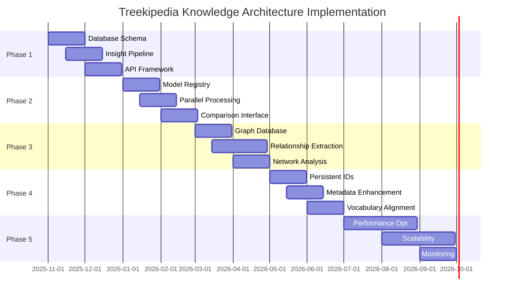

# TREEKIPEDIA KNOWLEDGE ARCHITECTURE
## From Field-Based Storage to Insight-Based Intelligence

*Version 1.0 - November 2025*

---

## Table of Contents

1. [Introduction: The Vision for Tree Intelligence](#1-introduction-the-vision-for-tree-intelligence)
2. [Current State Analysis: Understanding the Foundation](#2-current-state-analysis-understanding-the-foundation)
3. [The Insight Model: Atomic Units of Knowledge](#3-the-insight-model-atomic-units-of-knowledge)
4. [Knowledge Graph Design: Nodes, Edges, and Ontologies](#4-knowledge-graph-design-nodes-edges-and-ontologies)
5. [Storage Strategy: Multi-Tier Architecture](#5-storage-strategy-multi-tier-architecture)
6. [Query Patterns: From SQL to Conversational AI](#6-query-patterns-from-sql-to-conversational-ai)
7. [FAIR Principles Implementation](#7-fair-principles-implementation)
8. [Versioning Architecture: Evolution and Provenance](#8-versioning-architecture-evolution-and-provenance)
9. [Technical Specifications](#9-technical-specifications)
10. [Implementation Roadmap](#10-implementation-roadmap)
11. [Open Questions and Future Directions](#11-open-questions-and-future-directions)

---

## 1. Introduction: The Vision for Tree Intelligence

### 1.1 The Scale and Scope of Treekipedia

Treekipedia represents one of the most comprehensive attempts to unify global tree species knowledge into a single, queryable intelligence platform. With 67,743 species records spanning 50,797 unique species and 16,946 subspecies, the platform bridges the gap between fragmented scientific literature, occurrence data, and practical agroforestry knowledge. The system currently manages 5.7 million geohash tiles representing species occurrences, 31,796 Wikimedia images with proper attribution, 847 ecoregion polygons, and 6,819 intact forest landscape boundaries.

This scale presents both opportunities and challenges. The opportunity lies in creating the world's first comprehensive tree intelligence system—a foundation model for forest ecology that can answer complex questions like "Which nitrogen-fixing trees are compatible with coffee cultivation at 1500m elevation in Rwanda?" or "What are the pollinator dependencies of oak species in temperate deciduous forests?" The challenge lies in evolving from a traditional field-based database architecture to an insight-based knowledge graph that can reason about relationships, track provenance, and continuously improve as new AI models emerge.

### 1.2 Use Cases Driving Architecture

The architecture must support diverse use cases that span from scientific research to practical agroforestry applications:

**Agroforestry Planning**: Farmers and agricultural extension workers need to identify compatible tree species for intercropping, understanding not just basic compatibility but nuanced interactions—nitrogen fixation rates, shade patterns, water competition, allelopathic effects, and harvest timing. The system must recommend species combinations based on local conditions, existing crops, and desired outcomes.

**Ecological Restoration**: Conservation organizations require species recommendations for degraded land restoration, considering native status, succession stages, wildlife habitat value, and climate resilience. The architecture must support complex spatial queries that intersect occurrence data with environmental layers, intact forest boundaries, and climate projections.

**Species Matching and Substitution**: When a desired species isn't available or suitable, the system should identify functional equivalents based on ecological roles, growth characteristics, and use values. This requires semantic similarity calculations across multiple dimensions—ecological, morphological, and utilitarian.

**Conversational Querying**: Researchers, students, and practitioners increasingly expect natural language interfaces. A forester should be able to ask, "What trees host the most bird species in montane cloud forests?" and receive a structured, cited response. This demands an architecture that bridges structured data with large language models.

**Climate Adaptation Planning**: As climate zones shift, land managers need to identify species that will thrive under future conditions. The architecture must integrate current occurrence data with climate models, enabling predictive queries about species suitability under various warming scenarios.

### 1.3 Why Insight-Based Architecture Matters

Traditional database architectures, including Treekipedia's current PostgreSQL setup with its 115+ columns, treat data as static fields to be stored and retrieved. While this works for simple queries ("What is the maximum height of Quercus robur?"), it fails to capture the nuanced, interconnected nature of ecological knowledge. Consider the question of which species "depend on" an oak tree. The answer involves multiple types of relationships—insects that feed on leaves, birds that nest in branches, fungi that form mycorrhizal associations, mammals that consume acorns, and epiphytes that grow on bark. Each relationship has different strengths, seasonal variations, and geographic specificity.

An insight-based architecture treats each piece of knowledge as an atomic unit with its own provenance, confidence level, and temporal validity. Instead of a single "associated_species" field, we have thousands of typed relationships, each backed by evidence from specific sources. This granularity enables several critical capabilities:

**Multi-Source Synthesis**: The same claim might appear in multiple sources with varying confidence levels. An insight-based system can weigh evidence, identify consensus, and flag contradictions.

**Temporal Evolution**: Scientific understanding evolves. What we knew about mycorrhizal associations in 1990 differs from 2025 knowledge. Insights can be versioned and superseded while maintaining historical context.

**Model Comparison**: As AI models improve, we can regenerate insights and compare them. GPT-4's extraction of ecological relationships might differ from Claude's or local models like Qwen. Instead of choosing one "winner," we can present multiple perspectives with confidence scores.

**Granular Citations**: Every claim links to its sources, enabling verification and deeper exploration. A user can trace any piece of information back to the paper, database, or model that generated it.

---

## 2. Current State Analysis: Understanding the Foundation

### 2.1 The Species Knowledge Schema

The current Treekipedia database reflects a hybrid approach to knowledge management, with 121 distinct fields capturing various aspects of tree biology, ecology, and human use. Analyzing the schema reveals both strengths and limitations that inform our architectural evolution.

**Taxonomic Foundation** (Fields 1-12): The schema begins with robust taxonomic identification—species_scientific_name, subspecies, taxon_id, family, genus, class, and taxonomic_order. This taxonomic backbone, sourced from GBIF and other authoritative databases, provides the essential organizing principle for all other knowledge. The dual identification system (taxon_id and taxon_id_new) suggests ongoing reconciliation efforts to align with global standards.

**Dual-Source Fields** (Fields 15-84): A remarkable pattern emerges with paired _human and _ai fields for most ecological and morphological attributes. This includes general_description, ecological_function, elevation_ranges, compatible_soil_types, habitat, growth_form, leaf_type, and dozens more. This dual approach acknowledges that human-curated data remains the gold standard while AI-generated content can fill gaps. Currently, the system gives precedence to human data when available, displaying it with green highlighting versus blue for AI-generated content.

**Geospatial Richness** (Fields 13-14, 106-109): The schema captures geographic distribution through multiple lenses—ecoregions, biomes, countries_native, countries_invasive, and countries_introduced. The Present_Intact_Forest field reveals sophisticated spatial analysis, with values like "YES;NO" indicating species found both within and outside intact forests. This multi-faceted geographic representation enables complex spatial queries essential for restoration planning.

**Ecological Interactions** (Fields 114-121): The Globi_ prefixed fields represent a significant advancement—structured interaction data from the Global Biotic Interactions database. These fields capture pollination (pollinatedBy), herbivory (eatenBy), parasitism (hasParasite), seed dispersal (hasDispersalVector), and predation (preyedUponBy) relationships. However, these fields appear to be simple text lists rather than properly typed relationships with strength indicators or geographic specificity.

**Soil and Environmental Preferences** (Fields 94-105): The schema includes sophisticated soil modeling with texture and chemistry preferences at multiple levels—all, dominant, preferred, and tolerated. Similarly, pH and organic carbon (OC) content are captured across these gradients. This granularity suggests an understanding that species don't have simple binary relationships with soil conditions but rather optimum ranges and tolerance limits.

### 2.2 Occurrence Data Structure

The Parquet file analysis reveals the temporal-spatial structure of occurrence data:

```
species_scientific_name: Categorical species identifier
year: Temporal dimension (enabling historical analysis)
decimalLatitude/Longitude: Precise geographic coordinates
family: Higher taxonomic grouping
subspecies/taxon_full: Infraspecific variation
taxon_id_new: Unique identifier linking to main species table
```

With 5.7 million geohash tiles at L7 precision (~150m × 150m), the system achieves remarkable spatial resolution. The temporal dimension (year field) enables historical biodiversity analysis, tracking range shifts over time—critical for climate change studies. The Parquet format itself suggests optimization for analytical workloads, supporting efficient columnar queries across millions of records.

### 2.3 Identified Gaps and Limitations

**Relationship Poverty**: While Globi fields capture some interactions, they lack the richness needed for ecological modeling. Missing elements include interaction strength (obligate vs. facultative), seasonality (year-round vs. breeding season), geographic variation (interactions may differ across range), and confidence levels (well-studied vs. single observation).

**Agroforestry Practices Absence**: Despite fields for agroforestry_use_cases, practical management information is sparse. Missing data includes spacing requirements, pruning regimes, companion planting schedules, labor requirements, yield impacts on associated crops, and traditional ecological knowledge from indigenous practices.

**Provenance Weakness**: While reference_list and data_sources fields exist, they appear to be simple text fields rather than structured citations. This makes it impossible to trace specific claims to specific sources or assess the quality of evidence behind any given assertion.

**No Uncertainty Quantification**: The schema lacks confidence scores, uncertainty bounds, or data quality indicators. A maximum height might be based on a single herbarium specimen or thousands of field measurements—the schema doesn't distinguish.

**Limited Temporal Modeling**: While occurrence data includes years, the species attributes are essentially atemporal. There's no way to represent that a species' conservation status changed from "Least Concern" to "Vulnerable" in 2020, or that climate change is shifting elevation ranges upward.

**Missing Functional Traits**: Key functional ecology traits are absent—specific leaf area, wood density, seed mass, and resprouting ability. These traits enable prediction of ecosystem functioning and species responses to disturbance.

---

## 3. The Insight Model: Atomic Units of Knowledge

### 3.1 Defining the Atomic Unit

The fundamental shift from field-based to insight-based architecture begins with defining the atomic unit of knowledge—the Insight. Drawing from the concept of nanopublications in semantic web biology, each Insight represents a single, verifiable claim about the natural world, backed by evidence and enriched with metadata.

**The Insight Structure**:

```
Insight = {
    id: UUID (unique, persistent identifier)
    claim: Statement (the core assertion)
    evidence: Evidence[] (supporting sources, minimum 1, ideally 12+)
    confidence: Float (0.0-1.0, calculated from evidence quality)
    methodology: Enum (observation, experiment, model, expert_opinion)
    spatial_scope: Geometry (where this insight applies)
    temporal_scope: TimeRange (when this insight applies)
    created_date: Timestamp (when insight was generated)
    model_version: String (AI model or human curator ID)
    supersedes: UUID (previous version if updated)
    category: Enum (taxonomic, ecological, morphological, biochemical, etc.)
}
```

**Example Insight**:

```json
{
    "id": "550e8400-e29b-41d4-a716-446655440000",
    "claim": "Quercus robur forms ectomycorrhizal associations with Amanita citrina",
    "evidence": [
        {
            "source": "doi:10.1111/j.1469-8137.2010.03304.x",
            "type": "peer_reviewed_paper",
            "year": 2010,
            "confidence": 0.9
        },
        {
            "source": "GBIF:occurrence:123456789",
            "type": "observation",
            "year": 2023,
            "confidence": 0.7
        }
    ],
    "confidence": 0.85,
    "methodology": "observation",
    "spatial_scope": "POLYGON((...))", // European range
    "temporal_scope": {"start": "2010-01-01", "end": null},
    "created_date": "2025-11-01T10:00:00Z",
    "model_version": "gpt-4-turbo-2024",
    "category": "ecological_interaction"
}
```

### 3.2 Evidence Aggregation and Confidence Scoring

The confidence score represents our belief in the truth of an insight, derived from the quality and agreement of evidence sources. Drawing from meta-analysis principles in ecology, we implement a weighted evidence system:

**Evidence Weighting Factors**:

1. **Source Credibility** (0.0-1.0):
   - Peer-reviewed journal: 0.9-1.0 (varies by impact factor)
   - Government database: 0.8-0.9
   - Citizen science platform: 0.6-0.7
   - General web source: 0.3-0.5

2. **Temporal Recency** (decay function):
   - Current year: 1.0
   - 5 years old: 0.9
   - 10 years old: 0.7
   - 20+ years old: 0.5

3. **Methodological Rigor**:
   - Controlled experiment: 1.0
   - Field observation: 0.8
   - Model prediction: 0.6
   - Expert opinion: 0.4

**Confidence Calculation**:

```python
def calculate_confidence(evidence_list):
    if not evidence_list:
        return 0.0

    weighted_sum = 0
    weight_total = 0

    for evidence in evidence_list:
        credibility = get_source_credibility(evidence.source)
        recency = calculate_temporal_decay(evidence.year)
        methodology = get_methodology_weight(evidence.type)

        weight = credibility * recency * methodology
        weighted_sum += evidence.confidence * weight
        weight_total += weight

    base_confidence = weighted_sum / weight_total if weight_total > 0 else 0

    # Boost for multiple agreeing sources
    agreement_boost = min(0.2, len(evidence_list) * 0.02)

    return min(1.0, base_confidence + agreement_boost)
```

### 3.3 Insight Categories and Hierarchies

Insights organize into a hierarchical taxonomy that reflects both scientific disciplines and practical use cases:

**Primary Categories**:

1. **Taxonomic**: Name changes, synonyms, phylogenetic relationships
2. **Morphological**: Physical characteristics, growth forms, allometry
3. **Physiological**: Photosynthesis type, water use efficiency, nutrient uptake
4. **Ecological**: Habitat preferences, succession role, disturbance response
5. **Interactions**: Biotic relationships (pollination, herbivory, symbiosis)
6. **Biogeochemical**: Nutrient cycling, carbon sequestration, soil modification
7. **Phenological**: Timing of life events (flowering, fruiting, leaf fall)
8. **Ethnobotanical**: Traditional uses, cultural significance, local names
9. **Agronomic**: Cultivation practices, yield data, management techniques
10. **Conservation**: Threat assessments, population trends, restoration protocols

Each category supports subcategories. For example, Ecological insights subdivide into:
- Habitat associations (forest type, soil preference, moisture regime)
- Climatic tolerances (temperature range, precipitation needs, frost hardiness)
- Disturbance responses (fire adaptation, flood tolerance, wind resistance)
- Competitive abilities (shade tolerance, allelopathy, growth rate)

### 3.4 Multi-Model Versioning and Comparison

As AI models evolve, we must handle multiple, potentially conflicting insights about the same phenomenon. Rather than selecting a single "truth," the architecture embraces plurality while maintaining clarity:

**Model Registry**:

```json
{
    "model_id": "gpt-4-turbo-2024",
    "model_type": "large_language_model",
    "training_data": "web_corpus_2024",
    "biological_specialization": false,
    "confidence_calibration": 0.82,
    "known_biases": ["temperate_zone_bias", "english_language_bias"]
}
```

**Insight Comparison Framework**:

When multiple models generate insights about the same claim, we create an InsightCluster:

```json
{
    "cluster_id": "cluster-550e8400",
    "claim_template": "Maximum height of Quercus robur",
    "insights": [
        {
            "model": "gpt-4-turbo-2024",
            "value": "40 meters",
            "confidence": 0.85,
            "evidence_count": 15
        },
        {
            "model": "claude-3-opus",
            "value": "35-40 meters",
            "confidence": 0.90,
            "evidence_count": 18
        },
        {
            "model": "human-expert-2023",
            "value": "45 meters (exceptional specimens)",
            "confidence": 0.95,
            "evidence_count": 3
        }
    ],
    "consensus": {
        "method": "weighted_average",
        "value": "35-40 meters (exceptional: 45m)",
        "confidence": 0.90
    }
}
```

The system presents both consensus views and individual model outputs, allowing users to understand the range of scientific opinion and the confidence behind different claims.

---

## 4. Knowledge Graph Design: Nodes, Edges, and Ontologies

### 4.1 Node Types and Properties

The knowledge graph architecture employs a hybrid approach, combining the semantic richness of RDF with the performance characteristics of property graphs. This dual strategy leverages PostgreSQL with Apache AGE for core operations, Apache Jena for semantic reasoning, and specialized indexes for different query patterns.

**Core Node Types**:

1. **Species** (Primary Entity)
```cypher
(:Species {
    taxon_id: String,        // Unique identifier
    scientific_name: String,  // Current accepted name
    authority: String,        // Taxonomic authority
    rank: Enum,              // species, subspecies, variety
    created_date: DateTime,
    last_modified: DateTime,
    verification_status: Enum // verified, provisional, disputed
})
```

2. **Insight** (Knowledge Atom)
```cypher
(:Insight {
    id: UUID,
    claim_type: String,      // e.g., "maximum_height", "soil_preference"
    claim_value: JSON,       // Flexible structure for different claim types
    confidence: Float,
    methodology: String,
    created_date: DateTime,
    model_version: String
})
```

3. **Source** (Evidence Provider)
```cypher
(:Source {
    id: String,              // DOI, URL, or internal ID
    type: Enum,              // paper, database, observation, model
    title: String,
    authors: String[],
    year: Integer,
    credibility_score: Float,
    access_date: DateTime
})
```

4. **GeographicEntity** (Spatial Context)
```cypher
(:GeographicEntity {
    id: String,
    name: String,
    type: Enum,              // country, ecoregion, protected_area
    geometry: Geometry,      // PostGIS geometry
    area_km2: Float,
    climate_zone: String[]
})
```

5. **EcologicalContext** (Environmental Conditions)
```cypher
(:EcologicalContext {
    id: UUID,
    elevation_m: Range,      // {min: 100, max: 1500}
    precipitation_mm: Range,
    temperature_c: Range,
    soil_type: String[],
    ph_range: Range,
    forest_type: Enum
})
```

6. **Practice** (Management Technique)
```cypher
(:Practice {
    id: UUID,
    name: String,            // e.g., "coppicing", "pruning_regime_A"
    category: Enum,          // cultivation, harvesting, maintenance
    description: Text,
    frequency: String,       // e.g., "annual", "every_3_years"
    labor_hours: Float,
    equipment: String[]
})
```

7. **ChemicalCompound** (Biochemical Entity)
```cypher
(:ChemicalCompound {
    id: String,              // InChI or CAS number
    name: String,
    formula: String,
    class: Enum,            // alkaloid, terpene, phenolic
    biological_activity: String[]
})
```

### 4.2 Edge Types and Relationship Semantics

Edges in the knowledge graph carry rich semantics, including strength, directionality, and context:

**Primary Relationship Types**:

1. **HAS_INSIGHT**
```cypher
(:Species)-[:HAS_INSIGHT {
    category: String,
    priority: Integer,
    verification_status: Enum
}]->(:Insight)
```

2. **SUPPORTED_BY**
```cypher
(:Insight)-[:SUPPORTED_BY {
    relevance: Float,        // How directly the source supports this insight
    page_numbers: Integer[], // Specific pages in documents
    quote: String           // Relevant text excerpt
}]->(:Source)
```

3. **INTERACTS_WITH**
```cypher
(:Species)-[:INTERACTS_WITH {
    type: Enum,             // pollination, herbivory, parasitism, mutualism
    direction: Enum,        // benefits_from, harms, neutral
    strength: Float,        // 0.0-1.0, obligate = 1.0
    seasonality: String[],  // ["breeding_season", "winter"]
    life_stage: String[]    // ["seedling", "adult"]
}]->(:Species)
```

4. **OCCURS_IN**
```cypher
(:Species)-[:OCCURS_IN {
    status: Enum,           // native, introduced, invasive
    abundance: Enum,        // rare, common, dominant
    first_record: Date,
    last_confirmed: Date,
    occurrence_count: Integer
}]->(:GeographicEntity)
```

5. **THRIVES_IN**
```cypher
(:Species)-[:THRIVES_IN {
    suitability: Float,     // 0.0-1.0 habitat suitability
    limiting_factors: String[],
    optimal_conditions: JSON
}]->(:EcologicalContext)
```

6. **REQUIRES_PRACTICE**
```cypher
(:Species)-[:REQUIRES_PRACTICE {
    growth_stage: String[],  // When to apply this practice
    frequency: String,
    critical: Boolean,      // Essential vs. optional
    yield_impact: Float     // Percentage change in productivity
}]->(:Practice)
```

7. **PRODUCES_COMPOUND**
```cypher
(:Species)-[:PRODUCES_COMPOUND {
    plant_part: String[],   // ["leaf", "bark", "fruit"]
    concentration_mg_kg: Float,
    seasonal_variation: Boolean,
    extraction_method: String
}]->(:ChemicalCompound)
```

### 4.3 Hybrid Architecture: When to Use What

The decision to employ a hybrid architecture (PostgreSQL + AGE + Jena) stems from the diverse query patterns and performance requirements:

**PostgreSQL + PostGIS** (Relational + Spatial):
- **Use for**: Geospatial queries, bulk data storage, tabular reports
- **Examples**:
  - "Find all species within 10km of coordinates X,Y"
  - "Calculate species richness per ecoregion"
  - "Generate occurrence heatmaps"

**Apache AGE** (Property Graph in PostgreSQL):
- **Use for**: Graph traversals, relationship queries, network analysis
- **Examples**:
  - "Find all species connected to Oak through 2-degree interactions"
  - "Calculate centrality of species in pollination networks"
  - "Identify keystone species in ecosystem graphs"

**Apache Jena + Fuseki** (RDF Triple Store):
- **Use for**: Semantic reasoning, ontology queries, SPARQL federation
- **Examples**:
  - "Infer species relationships from taxonomic hierarchy"
  - "Query using standard vocabularies (Darwin Core)"
  - "Federate queries across external SPARQL endpoints"

**Integration Strategy**:

```python
class HybridKnowledgeGraph:
    def __init__(self):
        self.postgres = PostgreSQLConnection()
        self.age = ApacheAGEGraph()
        self.jena = JenaFusekiEndpoint()

    def query(self, query_type, params):
        if query_type == "spatial":
            return self.postgres.query_postgis(params)
        elif query_type == "graph_traversal":
            return self.age.cypher_query(params)
        elif query_type == "semantic":
            return self.jena.sparql_query(params)
        elif query_type == "hybrid":
            # Combine results from multiple backends
            spatial_results = self.postgres.query_postgis(params.spatial)
            graph_results = self.age.cypher_query(params.graph)
            return self.merge_results(spatial_results, graph_results)
```

### 4.4 Ontology Alignment and Vocabulary Management

To ensure interoperability with the broader scientific community, the knowledge graph aligns with established ontologies:

**Core Ontologies**:

1. **Darwin Core** (DwC): For occurrence and taxonomic data
   - Terms: scientificName, taxonRank, occurrenceID
   - Extensions: MeasurementOrFact for traits

2. **Environment Ontology** (ENVO): For habitat descriptions
   - Classes: forest biome, soil type, climate zone
   - Relations: adjacent_to, part_of, overlaps

3. **Plant Ontology** (PO): For morphological structures
   - Classes: leaf, flower, root system
   - Relations: part_of, develops_from

4. **Flora Phenotype Ontology** (FLOPO): For trait descriptions
   - Classes: plant height, leaf shape, flower color
   - Relations: has_quality, measured_by

**Vocabulary Mapping**:

```turtle
@prefix treekipedia: <https://treekipedia.org/ontology/> .
@prefix dwc: <http://rs.tdwg.org/dwc/terms/> .
@prefix envo: <http://purl.obolibrary.org/obo/ENVO_> .
@prefix po: <http://purl.obolibrary.org/obo/PO_> .

treekipedia:Species rdfs:subClassOf dwc:Taxon ;
    owl:equivalentClass [
        a owl:Class ;
        owl:intersectionOf (
            dwc:Organism
            [ a owl:Restriction ;
              owl:onProperty dwc:kingdom ;
              owl:hasValue "Plantae" ]
        )
    ] .

treekipedia:occurs_in owl:equivalentProperty dwc:locationID ;
    rdfs:domain treekipedia:Species ;
    rdfs:range envo:00000428 . # biome
```

---

## 5. Storage Strategy: Multi-Tier Architecture

### 5.1 Tier Definitions and Data Lifecycle

The multi-tier storage architecture optimizes for both performance and cost, recognizing that different data types have different access patterns, query requirements, and storage economics:

**Hot Tier** (PostgreSQL + PostGIS):
- **Data**: Active species records, recent insights, live occurrence data
- **Size**: ~10GB (core tables)
- **Access Pattern**: Millisecond queries, high concurrency
- **Retention**: Current version + 6 months history
- **Technology Stack**:
  ```sql
  -- Optimized for fast reads with appropriate indexes
  CREATE TABLE species_current (
      taxon_id VARCHAR(50) PRIMARY KEY,
      scientific_name VARCHAR(255) NOT NULL,
      embeddings vector(768), -- pgvector for similarity
      last_updated TIMESTAMP DEFAULT NOW()
  );

  CREATE INDEX idx_species_name_gin ON species_current
      USING gin(scientific_name gin_trgm_ops);
  CREATE INDEX idx_species_embeddings ON species_current
      USING ivfflat(embeddings vector_cosine_ops);
  ```

**Graph Tier** (Apache AGE / Neo4j):
- **Data**: Relationships, interaction networks, dependency graphs
- **Size**: ~50GB (millions of edges)
- **Access Pattern**: Graph traversals, pattern matching
- **Technology Choice Rationale**:
  - Apache AGE for PostgreSQL integration (single database)
  - Neo4j for complex graph algorithms (if needed)

  ```cypher
  -- Example AGE query for interaction networks
  SELECT * FROM cypher('species_graph', $$
      MATCH (s1:Species)-[r:INTERACTS_WITH*1..3]-(s2:Species)
      WHERE s1.taxon_id = 'quercus_robur'
      RETURN s2.scientific_name, r, length(r) as distance
      ORDER BY distance
  $$) as (species_name agtype, relationships agtype, distance agtype);
  ```

**Semantic Tier** (Apache Jena Fuseki):
- **Data**: RDF triples, ontologies, vocabularies
- **Size**: ~20GB (billions of triples)
- **Access Pattern**: SPARQL queries, reasoning, federation
- **Configuration**:
  ```turtle
  # Dataset configuration
  @prefix fuseki: <http://jena.apache.org/fuseki#> .
  @prefix rdf: <http://www.w3.org/1999/02/22-rdf-syntax-ns#> .
  @prefix tdb2: <http://jena.apache.org/2016/tdb#> .

  <#treekipedia> a fuseki:Service ;
      fuseki:name "treekipedia" ;
      fuseki:dataset <#dataset> ;
      fuseki:endpoint [ fuseki:operation fuseki:query ] ;
      fuseki:endpoint [ fuseki:operation fuseki:update ] ;
      fuseki:endpoint [ fuseki:operation fuseki:gsp_r ] .

  <#dataset> a tdb2:DatasetTDB2 ;
      tdb2:location "/data/fuseki/treekipedia" ;
      tdb2:unionDefaultGraph true .
  ```

**Cold Tier** (Object Storage - S3/MinIO):
- **Data**: Historical snapshots, research papers, images, archived datasets
- **Size**: ~500GB and growing
- **Access Pattern**: Batch processing, rare access
- **Organization**:
  ```
  /cold-storage/
  ├── /pdfs/
  │   ├── /2025/
  │   │   ├── {doi_hash}_paper.pdf
  │   │   └── {doi_hash}_metadata.json
  ├── /images/
  │   ├── /species/{taxon_id}/
  │   │   ├── primary_800x600.jpg
  │   │   └── thumbnails/
  ├── /datasets/
  │   ├── /yearly_snapshots/
  │   │   └── treekipedia_2025_full.parquet
  └── /models/
      └── /embeddings/
          └── species_embeddings_v2.npz
  ```

**Immutable Tier** (IPFS):
- **Data**: Versioned ontologies, published research outputs, attestations
- **Size**: ~5GB (high-value, permanent records)
- **Access Pattern**: Content-addressed, verification-focused
- **Implementation**:
  ```python
  import ipfshttpclient

  class IPFSArchive:
      def __init__(self):
          self.client = ipfshttpclient.connect()

      def archive_insight(self, insight):
          # Create IPLD-compatible structure
          ipld_object = {
              "@context": "https://treekipedia.org/context/v1",
              "@type": "Insight",
              "id": insight.id,
              "claim": insight.claim,
              "evidence": insight.evidence,
              "timestamp": insight.created_date.isoformat()
          }

          # Pin to IPFS
          result = self.client.dag.put(ipld_object)
          cid = result['Cid']['/']

          # Store CID in hot tier for reference
          self.update_insight_cid(insight.id, cid)

          return cid
  ```

### 5.2 Data Movement and Lifecycle Policies

**Automated Tiering Logic**:

```python
class DataTieringManager:
    def __init__(self):
        self.hot_tier = PostgreSQLTier()
        self.graph_tier = GraphTier()
        self.cold_tier = S3Tier()
        self.ipfs_tier = IPFSTier()

    def tier_insight(self, insight):
        age_days = (datetime.now() - insight.created_date).days
        access_count = insight.access_metrics.count_30d

        if age_days < 30 or access_count > 100:
            return "hot"
        elif insight.has_relationships():
            return "graph"
        elif age_days > 365 and access_count < 10:
            return "cold"
        elif insight.is_published:
            return "ipfs"  # Also archive to IPFS
        else:
            return "warm"  # Keep in PostgreSQL but deprioritize

    def migrate_data(self):
        # Run daily migration job
        insights = self.hot_tier.get_migration_candidates()

        for insight in insights:
            target_tier = self.tier_insight(insight)

            if target_tier == "cold":
                # Compress and move to S3
                archived = self.cold_tier.archive(insight)
                self.hot_tier.replace_with_pointer(insight.id, archived.s3_key)

            elif target_tier == "ipfs":
                # Pin to IPFS while keeping in hot tier
                cid = self.ipfs_tier.pin(insight)
                self.hot_tier.update_cid(insight.id, cid)
```

### 5.3 Caching Strategy

**Multi-Level Cache Architecture**:

1. **Application Cache** (Redis):
   ```python
   class RedisCache:
       def __init__(self):
           self.redis = redis.Redis(
               host='localhost',
               decode_responses=True,
               max_connections=50
           )

       def cache_species(self, species):
           key = f"species:{species.taxon_id}"
           self.redis.setex(
               key,
               timedelta(hours=6),  # 6-hour TTL
               json.dumps(species.to_dict())
           )

       def cache_query_result(self, query_hash, result):
           key = f"query:{query_hash}"
           self.redis.setex(
               key,
               timedelta(minutes=30),  # 30-minute TTL for queries
               pickle.dumps(result)
           )
   ```

2. **Database Query Cache** (PostgreSQL):
   ```sql
   -- Materialized views for expensive aggregations
   CREATE MATERIALIZED VIEW species_interaction_summary AS
   SELECT
       s.taxon_id,
       s.scientific_name,
       COUNT(DISTINCT i.target_species) as interaction_count,
       array_agg(DISTINCT i.interaction_type) as interaction_types,
       AVG(i.strength) as avg_interaction_strength
   FROM species s
   LEFT JOIN interactions i ON s.taxon_id = i.source_species
   GROUP BY s.taxon_id, s.scientific_name;

   -- Refresh strategy
   CREATE OR REPLACE FUNCTION refresh_interaction_summary()
   RETURNS void AS $$
   BEGIN
       REFRESH MATERIALIZED VIEW CONCURRENTLY species_interaction_summary;
   END;
   $$ LANGUAGE plpgsql;
   ```

3. **CDN Cache** (CloudFlare/Fastly):
   - Static species pages
   - API responses for common queries
   - Image derivatives

---

## 6. Query Patterns: From SQL to Conversational AI

### 6.1 Query Type Taxonomy

The system must support six distinct query patterns, each with different performance characteristics and implementation strategies:

**1. Structured Attribute Queries** (SQL):
```sql
-- Find tall nitrogen-fixing trees
SELECT s.scientific_name, s.max_height_m, i.claim_value
FROM species s
JOIN insights i ON s.taxon_id = i.species_id
WHERE i.claim_type = 'nitrogen_fixation'
  AND i.claim_value::jsonb->>'rate' IS NOT NULL
  AND s.max_height_m > 20
ORDER BY s.max_height_m DESC;
```

**2. Spatial Queries** (PostGIS):
```sql
-- Species within 50km suitable for restoration
WITH target_area AS (
    SELECT ST_Buffer(
        ST_MakePoint(-1.2921, 36.8219)::geography,
        50000
    )::geometry as geom
)
SELECT DISTINCT s.scientific_name, s.taxon_id,
       COUNT(o.occurrence_id) as local_occurrences
FROM species s
JOIN occurrences o ON s.taxon_id = o.taxon_id
JOIN target_area t ON ST_Within(o.geometry, t.geom)
WHERE s.native_status = 'native'
  AND s.conservation_status NOT IN ('CR', 'EN')
GROUP BY s.scientific_name, s.taxon_id
HAVING COUNT(o.occurrence_id) > 10
ORDER BY local_occurrences DESC;
```

**3. Graph Traversals** (Cypher/AGE):
```cypher
-- Find species forming mutualistic networks with oak
MATCH path = (oak:Species {genus: 'Quercus'})-
      [:INTERACTS_WITH*1..3 {direction: 'mutualism'}]-
      (partner:Species)
WHERE NOT partner.genus = 'Quercus'
WITH partner, length(path) as distance,
     [r in relationships(path) | r.strength] as strengths
RETURN partner.scientific_name,
       distance,
       reduce(s = 1.0, x IN strengths | s * x) as compound_strength
ORDER BY compound_strength DESC
LIMIT 20
```

**4. Semantic Queries** (SPARQL):
```sparql
PREFIX tree: <https://treekipedia.org/ontology/>
PREFIX envo: <http://purl.obolibrary.org/obo/ENVO_>
PREFIX dwc: <http://rs.tdwg.org/dwc/terms/>

SELECT ?species ?scientificName ?biome ?trait ?value
WHERE {
    ?species a tree:Species ;
             dwc:scientificName ?scientificName ;
             tree:occurs_in ?location .

    ?location a envo:00000428 ;  # biome
              rdfs:label ?biome .

    ?species tree:has_trait ?trait_instance .
    ?trait_instance a ?trait ;
                    tree:value ?value .

    FILTER(regex(?biome, "tropical", "i"))
    FILTER(?trait IN (tree:WoodDensity, tree:SpecificLeafArea))
}
ORDER BY ?scientificName ?trait
```

**5. Vector Similarity** (pgvector):
```sql
-- Find ecologically similar species
WITH target_species AS (
    SELECT embeddings
    FROM species_embeddings
    WHERE taxon_id = 'quercus_robur'
)
SELECT s.scientific_name,
       s.taxon_id,
       1 - (s.embeddings <=> t.embeddings) as similarity
FROM species_embeddings s, target_species t
WHERE s.taxon_id != 'quercus_robur'
ORDER BY s.embeddings <=> t.embeddings
LIMIT 10;
```

**6. Conversational Queries** (LLM-powered):
```python
class ConversationalQueryEngine:
    def __init__(self):
        self.llm = LLMClient()
        self.sql_engine = SQLEngine()
        self.graph_engine = GraphEngine()
        self.vector_engine = VectorEngine()

    def process_query(self, natural_language_query):
        # Step 1: Parse intent and extract entities
        parsed = self.llm.parse_query(natural_language_query)
        """
        Example parsed output:
        {
            "intent": "find_compatible_species",
            "constraints": {
                "elevation": "1500m",
                "location": "Rwanda",
                "use_case": "coffee_agroforestry",
                "trait": "nitrogen_fixing"
            },
            "output_format": "ranked_list"
        }
        """

        # Step 2: Decompose into sub-queries
        sub_queries = self.decompose_query(parsed)

        # Step 3: Execute across appropriate engines
        results = {}
        for sub_query in sub_queries:
            if sub_query.type == "spatial":
                results[sub_query.id] = self.sql_engine.execute_postgis(sub_query)
            elif sub_query.type == "trait":
                results[sub_query.id] = self.vector_engine.similarity_search(sub_query)
            elif sub_query.type == "interaction":
                results[sub_query.id] = self.graph_engine.traverse(sub_query)

        # Step 4: Synthesize results
        synthesis = self.synthesize_results(results, parsed)

        # Step 5: Generate natural language response
        response = self.llm.generate_response(synthesis, parsed)

        return response
```

### 6.2 Query Optimization Strategies

**Hybrid Query Execution Plan**:

```python
class QueryOptimizer:
    def __init__(self):
        self.statistics = QueryStatistics()
        self.cache = QueryCache()

    def optimize(self, query_plan):
        # Analyze query complexity
        complexity = self.analyze_complexity(query_plan)

        # Check cache
        cache_key = self.generate_cache_key(query_plan)
        if cached := self.cache.get(cache_key):
            return cached

        # Choose execution strategy
        if complexity.is_simple_filter:
            # Direct SQL
            return self.execute_sql(query_plan)

        elif complexity.has_spatial and complexity.has_graph:
            # Parallel execution with merge
            spatial_future = self.async_spatial(query_plan.spatial)
            graph_future = self.async_graph(query_plan.graph)

            spatial_results = await spatial_future
            graph_results = await graph_future

            # Merge on common keys
            return self.merge_results(
                spatial_results,
                graph_results,
                join_key='taxon_id'
            )

        elif complexity.requires_reasoning:
            # Use semantic tier
            sparql = self.translate_to_sparql(query_plan)
            return self.execute_sparql(sparql)
```

### 6.3 Example: Complex Multi-Modal Query

**User Query**: "Find nitrogen-fixing trees compatible with coffee at 1500m in Rwanda"

**Decomposition**:

```python
def decompose_coffee_companion_query():
    # Sub-query 1: Geographic constraint
    geo_query = """
    SELECT taxon_id FROM species_occurrences
    WHERE ST_Within(geometry,
        (SELECT geometry FROM countries WHERE name = 'Rwanda'))
    AND elevation_m BETWEEN 1400 AND 1600
    """

    # Sub-query 2: Nitrogen fixation trait
    trait_query = """
    SELECT species_id, confidence FROM insights
    WHERE claim_type = 'nitrogen_fixation'
    AND confidence > 0.7
    """

    # Sub-query 3: Coffee compatibility (graph)
    compat_query = """
    MATCH (coffee:Species {scientific_name: 'Coffea arabica'})-
          [:COMPATIBLE_WITH]-(tree:Species)
    RETURN tree.taxon_id
    """

    # Sub-query 4: Agroforestry practices
    practice_query = """
    SELECT DISTINCT species_id FROM species_practices
    WHERE practice_category = 'agroforestry'
    AND practice_name IN ('shade_provision', 'soil_improvement')
    """

    # Sub-query 5: Synthesis via embeddings
    embedding_query = """
    SELECT taxon_id,
           similarity(embedding, coffee_agroforestry_embedding) as score
    FROM species_embeddings
    WHERE taxon_id IN (previous_results)
    ORDER BY score DESC
    """

    return [geo_query, trait_query, compat_query,
            practice_query, embedding_query]
```

**Result Synthesis**:

```python
def synthesize_results(results):
    # Weight different evidence types
    weights = {
        'geographic': 0.25,    # Must be in region
        'nitrogen_fixation': 0.30,  # Core requirement
        'compatibility': 0.20,  # Direct evidence
        'practices': 0.15,     # Practical knowledge
        'embedding': 0.10      # Semantic similarity
    }

    # Calculate composite scores
    species_scores = {}
    for species_id in get_candidate_species(results):
        score = 0
        score += weights['geographic'] * in_rwanda_score(species_id)
        score += weights['nitrogen_fixation'] * n_fixation_score(species_id)
        score += weights['compatibility'] * compatibility_score(species_id)
        score += weights['practices'] * practice_score(species_id)
        score += weights['embedding'] * embedding_score(species_id)

        species_scores[species_id] = {
            'total_score': score,
            'evidence': compile_evidence(species_id, results),
            'confidence': calculate_confidence(species_id, results)
        }

    return rank_by_score(species_scores)
```

---

## 7. FAIR Principles Implementation

### 7.1 Findable: Persistent Identifiers and Rich Metadata

Making tree knowledge findable requires persistent, globally unique identifiers and comprehensive metadata that enables both human and machine discovery:

**Identifier Strategy**:

```python
class IdentifierManager:
    def __init__(self):
        self.namespace = "https://treekipedia.org/id/"

    def generate_insight_id(self):
        # UUID v5 for deterministic IDs from content
        namespace_uuid = uuid.UUID('6ba7b810-9dad-11d1-80b4-00c04fd430c8')
        return str(uuid.uuid5(namespace_uuid, content_hash))

    def generate_species_uri(self, taxon_id):
        # Align with GBIF where possible
        if gbif_id := self.get_gbif_id(taxon_id):
            return f"https://www.gbif.org/species/{gbif_id}"
        else:
            return f"{self.namespace}species/{taxon_id}"

    def mint_doi(self, dataset):
        # For published datasets via DataCite
        metadata = {
            "data": {
                "type": "dois",
                "attributes": {
                    "prefix": "10.12345",  # Treekipedia prefix
                    "suffix": dataset.id,
                    "titles": [{"title": dataset.title}],
                    "creators": dataset.creators,
                    "publisher": "Treekipedia",
                    "publicationYear": dataset.year,
                    "types": {"resourceTypeGeneral": "Dataset"}
                }
            }
        }
        return self.datacite_client.create_doi(metadata)
```

**Metadata Schema** (DataCite + Darwin Core):

```xml
<resource xmlns="http://datacite.org/schema/kernel-4">
    <identifier identifierType="DOI">10.12345/treekipedia.2025.001</identifier>
    <titles>
        <title>Global Tree Species Interaction Network</title>
    </titles>
    <creators>
        <creator>
            <creatorName>Treekipedia Consortium</creatorName>
            <affiliation>Global Forest Observatory</affiliation>
        </creator>
    </creators>
    <subjects>
        <subject schemeURI="http://dewey.info/" subjectScheme="dewey">580</subject>
        <subject>forest ecology</subject>
        <subject>species interactions</subject>
        <subject>knowledge graph</subject>
    </subjects>
    <contributors>
        <contributor contributorType="DataCollector">
            <contributorName>GBIF Network</contributorName>
        </contributor>
    </contributors>
    <relatedIdentifiers>
        <relatedIdentifier relatedIdentifierType="DOI"
                          relationType="IsSupplementTo">
            10.1038/nature12345
        </relatedIdentifier>
    </relatedIdentifiers>
</resource>
```

**Search Index Structure**:

```python
class SearchIndex:
    def __init__(self):
        self.es = Elasticsearch(['localhost:9200'])

    def index_species(self, species):
        doc = {
            "taxon_id": species.taxon_id,
            "scientific_name": species.scientific_name,
            "common_names": species.common_names,
            "description": species.description,
            "keywords": self.extract_keywords(species),
            "embeddings": species.embeddings.tolist(),
            "metadata": {
                "last_updated": species.last_updated,
                "completeness": self.calculate_completeness(species),
                "quality_score": species.quality_score
            },
            "searchable_text": self.create_searchable_text(species)
        }

        self.es.index(
            index='species',
            id=species.taxon_id,
            body=doc
        )

    def search(self, query, filters=None):
        return self.es.search(
            index='species',
            body={
                "query": {
                    "multi_match": {
                        "query": query,
                        "fields": ["scientific_name^3",
                                  "common_names^2",
                                  "searchable_text"],
                        "type": "best_fields"
                    }
                },
                "filter": filters or {}
            }
        )
```

### 7.2 Accessible: Open Protocols and Standards

Accessibility ensures that once found, data can be retrieved using open, free, and universally implementable protocols:

**Multi-Protocol Access**:

1. **RESTful API** (Primary Access):
```python
@app.route('/api/v1/species/<taxon_id>')
def get_species(taxon_id):
    # Content negotiation
    accept = request.headers.get('Accept', 'application/json')

    if 'application/ld+json' in accept:
        # Return JSON-LD with schema.org vocabulary
        return jsonify(species_to_jsonld(taxon_id))
    elif 'text/turtle' in accept:
        # Return RDF Turtle
        return species_to_rdf(taxon_id), 200, {'Content-Type': 'text/turtle'}
    else:
        # Default JSON
        return jsonify(get_species_json(taxon_id))

@app.route('/api/v1/insights')
def query_insights():
    # GraphQL-like query support
    query = request.json
    return jsonify(execute_insight_query(query))
```

2. **SPARQL Endpoint**:
```python
@app.route('/sparql')
def sparql_endpoint():
    query = request.args.get('query')
    format = request.args.get('format', 'json')

    results = fuseki_client.query(query)

    if format == 'json':
        return jsonify(results)
    elif format == 'csv':
        return results_to_csv(results)
    elif format == 'xml':
        return results_to_xml(results)
```

3. **OAI-PMH for Harvesting**:
```xml
<!-- ListRecords response -->
<OAI-PMH xmlns="http://www.openarchives.org/OAI/2.0/">
    <responseDate>2025-11-01T10:00:00Z</responseDate>
    <request verb="ListRecords" metadataPrefix="oai_dc">
        https://treekipedia.org/oai
    </request>
    <ListRecords>
        <record>
            <header>
                <identifier>oai:treekipedia.org:species/quercus_robur</identifier>
                <datestamp>2025-10-15</datestamp>
                <setSpec>species</setSpec>
            </header>
            <metadata>
                <!-- Dublin Core metadata -->
            </metadata>
        </record>
    </ListRecords>
</OAI-PMH>
```

4. **Bulk Data Downloads**:
```python
@app.route('/data/bulk/<dataset>')
def bulk_download(dataset):
    # Provide full dumps in multiple formats
    format = request.args.get('format', 'parquet')

    if dataset == 'species':
        if format == 'parquet':
            return send_file('data/species_latest.parquet')
        elif format == 'csv':
            return send_file('data/species_latest.csv.gz')
        elif format == 'jsonl':
            return send_file('data/species_latest.jsonl.gz')
        elif format == 'rdf':
            return send_file('data/species_latest.ttl.gz')
```

### 7.3 Interoperable: Shared Vocabularies and Standards

Interoperability ensures data can be integrated with other datasets and systems through the use of shared vocabularies and standards:

**Vocabulary Mapping Service**:

```python
class VocabularyMapper:
    def __init__(self):
        self.mappings = {
            'darwin_core': self.load_dwc_mappings(),
            'schema_org': self.load_schema_mappings(),
            'dublin_core': self.load_dc_mappings()
        }

    def to_darwin_core(self, species):
        return {
            "dwc:taxonID": species.taxon_id,
            "dwc:scientificName": species.scientific_name,
            "dwc:kingdom": "Plantae",
            "dwc:family": species.family,
            "dwc:genus": species.genus,
            "dwc:specificEpithet": species.specific_epithet,
            "dwc:taxonRank": species.rank,
            "dwc:nomenclaturalStatus": species.nomenclatural_status,
            "dwc:occurrenceStatus": "present",
            "dcterms:modified": species.last_updated
        }

    def to_schema_org(self, species):
        return {
            "@context": "https://schema.org",
            "@type": "Taxon",
            "identifier": species.taxon_id,
            "name": species.scientific_name,
            "alternateName": species.common_names,
            "parentTaxon": {
                "@type": "Taxon",
                "name": species.genus,
                "taxonRank": "genus"
            },
            "taxonRank": species.rank,
            "mainEntityOfPage": f"https://treekipedia.org/species/{species.taxon_id}"
        }
```

**Cross-Reference Management**:

```sql
CREATE TABLE vocabulary_mappings (
    internal_field VARCHAR(100),
    external_vocabulary VARCHAR(50),
    external_term VARCHAR(200),
    mapping_type ENUM('exact', 'narrow', 'broad', 'related'),
    confidence FLOAT,
    notes TEXT,
    PRIMARY KEY (internal_field, external_vocabulary)
);

-- Example mappings
INSERT INTO vocabulary_mappings VALUES
('maximum_height', 'darwin_core', 'dwc:measurementValue', 'narrow', 0.9, 'With measurementType="height"'),
('elevation_range', 'envo', 'ENVO:00000428', 'related', 0.8, 'Elevation as environmental factor'),
('nitrogen_fixation', 'go', 'GO:0009399', 'exact', 1.0, 'Biological nitrogen fixation');
```

### 7.4 Reusable: Clear Licenses and Provenance

Reusability ensures data can be used for future research with clear licensing and comprehensive provenance:

**License Management**:

```python
class LicenseManager:
    def __init__(self):
        self.default_license = "CC-BY-4.0"
        self.license_hierarchy = {
            "CC0": 0,      # Public domain
            "CC-BY": 1,    # Attribution
            "CC-BY-SA": 2, # Share-alike
            "CC-BY-NC": 3, # Non-commercial
            "proprietary": 4
        }

    def determine_insight_license(self, evidence_list):
        # Most restrictive license applies
        max_restriction = 0
        applicable_license = "CC0"

        for evidence in evidence_list:
            source_license = self.get_source_license(evidence.source)
            restriction = self.license_hierarchy.get(source_license, 4)

            if restriction > max_restriction:
                max_restriction = restriction
                applicable_license = source_license

        return applicable_license

    def generate_attribution(self, insight):
        attributions = []
        for evidence in insight.evidence:
            attr = self.format_attribution(evidence)
            attributions.append(attr)

        return {
            "license": self.determine_insight_license(insight.evidence),
            "attributions": attributions,
            "citation": self.generate_citation(insight)
        }
```

**Provenance Tracking** (PROV-O Ontology):

```turtle
@prefix prov: <http://www.w3.org/ns/prov#> .
@prefix tree: <https://treekipedia.org/> .

tree:insight_550e8400 a prov:Entity ;
    prov:wasGeneratedBy tree:extraction_activity_001 ;
    prov:wasDerivedFrom tree:source_doi_10_1234 ;
    prov:wasAttributedTo tree:model_gpt4_turbo ;
    prov:generatedAtTime "2025-11-01T10:00:00Z"^^xsd:dateTime .

tree:extraction_activity_001 a prov:Activity ;
    prov:used tree:source_doi_10_1234 ;
    prov:wasAssociatedWith tree:model_gpt4_turbo ;
    prov:startedAtTime "2025-11-01T09:59:00Z"^^xsd:dateTime ;
    prov:endedAtTime "2025-11-01T10:00:00Z"^^xsd:dateTime ;
    prov:generated tree:insight_550e8400 .

tree:model_gpt4_turbo a prov:Agent ;
    prov:actedOnBehalfOf tree:treekipedia_system ;
    prov:hadPlan tree:extraction_protocol_v2 .
```

**Data Quality Indicators**:

```python
class DataQualityAssessment:
    def calculate_fair_score(self, dataset):
        scores = {
            'findable': self.assess_findability(dataset),
            'accessible': self.assess_accessibility(dataset),
            'interoperable': self.assess_interoperability(dataset),
            'reusable': self.assess_reusability(dataset)
        }

        return {
            'individual_scores': scores,
            'total_score': sum(scores.values()) / 4,
            'recommendations': self.generate_recommendations(scores)
        }

    def assess_findability(self, dataset):
        score = 0.0
        if dataset.has_persistent_id:
            score += 0.25
        if dataset.has_rich_metadata:
            score += 0.25
        if dataset.is_indexed:
            score += 0.25
        if dataset.has_clear_versioning:
            score += 0.25
        return score
```

---

## 8. Versioning Architecture: Evolution and Provenance

### 8.1 Multi-Level Versioning Strategy

The versioning architecture addresses the temporal evolution of knowledge at multiple levels, recognizing that scientific understanding, AI capabilities, and data schemas all evolve independently:

**Insight Versioning**:

```python
class InsightVersion:
    def __init__(self):
        self.version_chain = []  # Blockchain-inspired immutable history

    def create_new_version(self, insight, reason):
        new_version = {
            "id": str(uuid.uuid4()),
            "version": len(self.version_chain) + 1,
            "content": insight,
            "timestamp": datetime.utcnow(),
            "reason": reason,  # "new_evidence", "model_update", "correction"
            "previous_version": self.version_chain[-1]["id"] if self.version_chain else None,
            "hash": self.calculate_hash(insight),
            "signature": self.sign_version(insight)  # Cryptographic signing
        }

        # Immutable append
        self.version_chain.append(new_version)

        # Update current pointer
        self.update_current_version(new_version["id"])

        return new_version

    def calculate_hash(self, insight):
        # Create deterministic hash of content
        content_str = json.dumps(insight, sort_keys=True)
        return hashlib.sha256(content_str.encode()).hexdigest()
```

**Model Version Tracking**:

```sql
CREATE TABLE model_versions (
    model_id VARCHAR(50) PRIMARY KEY,
    model_family VARCHAR(50),  -- gpt, claude, llama, etc.
    version VARCHAR(20),
    release_date DATE,
    training_cutoff DATE,
    capabilities JSONB,  -- {"biological_knowledge": 0.85, "reasoning": 0.90}
    known_biases JSONB,  -- ["geographic_bias_temperate", "taxonomy_bias_angiosperms"]
    deprecation_date DATE,
    replacement_model VARCHAR(50)
);

CREATE TABLE model_performance (
    model_id VARCHAR(50),
    task_type VARCHAR(50),  -- extraction, reasoning, summarization
    benchmark VARCHAR(50),
    score FLOAT,
    evaluated_date DATE,
    PRIMARY KEY (model_id, task_type, benchmark)
);
```

### 8.2 Conflict Resolution Strategies

When multiple models or versions produce conflicting insights, the system employs sophisticated resolution strategies:

```python
class ConflictResolver:
    def __init__(self):
        self.strategies = {
            'consensus': self.weighted_consensus,
            'authority': self.defer_to_authority,
            'recency': self.prefer_recent,
            'ensemble': self.ensemble_voting
        }

    def resolve_conflict(self, insight_cluster, strategy='ensemble'):
        resolver = self.strategies[strategy]
        return resolver(insight_cluster)

    def ensemble_voting(self, insight_cluster):
        # Weighted voting based on model performance
        votes = {}
        total_weight = 0

        for insight in insight_cluster.insights:
            model_weight = self.get_model_weight(
                insight.model_version,
                insight_cluster.claim_type
            )

            # Normalize similar values (e.g., "40m" and "40 meters")
            normalized_value = self.normalize_value(insight.claim_value)

            if normalized_value not in votes:
                votes[normalized_value] = 0

            votes[normalized_value] += model_weight * insight.confidence
            total_weight += model_weight

        # Find consensus value
        best_value = max(votes, key=votes.get)
        consensus_confidence = votes[best_value] / total_weight

        # Generate explanation
        explanation = self.generate_resolution_explanation(
            insight_cluster,
            best_value,
            votes
        )

        return {
            'resolved_value': best_value,
            'confidence': consensus_confidence,
            'resolution_method': 'ensemble_voting',
            'explanation': explanation,
            'alternative_values': votes
        }
```

### 8.3 Schema Evolution Management

Database schema changes must preserve historical data while enabling new capabilities:

```python
class SchemaVersionManager:
    def __init__(self):
        self.current_version = "2.0"
        self.migration_history = []

    def apply_migration(self, migration):
        # Create backup
        backup_id = self.create_backup()

        try:
            # Begin transaction
            with self.db.transaction():
                # Apply forward migration
                migration.forward()

                # Update version tracking
                self.record_migration({
                    'version': migration.version,
                    'applied_at': datetime.utcnow(),
                    'backup_id': backup_id,
                    'changes': migration.describe_changes()
                })

                # Run validation
                self.validate_schema()

        except Exception as e:
            # Rollback on failure
            self.rollback_to_backup(backup_id)
            raise SchemasMigrationError(f"Migration failed: {e}")

    def generate_compatibility_layer(self, old_version, new_version):
        """Create views/functions for backward compatibility"""

        # Example: Field renamed from 'max_height' to 'maximum_height_m'
        compatibility_sql = """
        CREATE VIEW species_v1_compatible AS
        SELECT
            taxon_id,
            scientific_name,
            maximum_height_m as max_height,  -- Old name
            *
        FROM species;

        -- Function for old API compatibility
        CREATE FUNCTION get_species_v1(p_taxon_id VARCHAR)
        RETURNS TABLE LIKE species_v1_compatible AS $$
        BEGIN
            RETURN QUERY SELECT * FROM species_v1_compatible
            WHERE taxon_id = p_taxon_id;
        END;
        $$ LANGUAGE plpgsql;
        """

        return compatibility_sql
```

### 8.4 Re-Research Strategy

As models improve, systematic re-research updates the knowledge base:

```python
class ReResearchOrchestrator:
    def __init__(self):
        self.priority_queue = PriorityQueue()
        self.model_registry = ModelRegistry()

    def identify_reresearch_candidates(self):
        candidates = []

        # Old insights (>1 year since last update)
        old_insights = self.db.query("""
            SELECT id, species_id, claim_type, last_updated, confidence
            FROM insights
            WHERE last_updated < NOW() - INTERVAL '1 year'
            AND confidence < 0.8
        """)

        for insight in old_insights:
            priority = self.calculate_priority(insight)
            candidates.append((priority, insight))

        # Low confidence insights
        low_confidence = self.db.query("""
            SELECT id, species_id, claim_type, confidence
            FROM insights
            WHERE confidence < 0.6
            AND evidence_count < 3
        """)

        for insight in low_confidence:
            priority = 0.9  # High priority
            candidates.append((priority, insight))

        return sorted(candidates, reverse=True)

    def execute_reresearch(self, insight, new_model):
        # Gather original sources
        original_sources = self.get_insight_sources(insight.id)

        # Search for new sources
        new_sources = self.search_new_literature(
            insight.species_id,
            insight.claim_type,
            since=insight.last_updated
        )

        # Re-extract with new model
        all_sources = original_sources + new_sources
        new_extraction = new_model.extract(
            sources=all_sources,
            claim_type=insight.claim_type,
            context=self.get_species_context(insight.species_id)
        )

        # Compare with original
        if self.significantly_different(insight, new_extraction):
            # Create new version
            self.create_insight_version(
                original=insight,
                new=new_extraction,
                reason='model_improvement',
                model=new_model.id
            )

            return 'updated'
        else:
            # Update confidence if more evidence
            if len(new_sources) > 0:
                self.boost_confidence(insight, new_sources)
                return 'reinforced'

            return 'unchanged'
```

---

## 9. Technical Specifications

### 9.1 Database Schema

```sql
-- Core insight table
CREATE TABLE insights (
    id UUID PRIMARY KEY DEFAULT gen_random_uuid(),
    species_id VARCHAR(50) REFERENCES species(taxon_id),
    claim_type VARCHAR(100) NOT NULL,
    claim_value JSONB NOT NULL,
    confidence FLOAT CHECK (confidence >= 0 AND confidence <= 1),
    methodology VARCHAR(50),
    spatial_scope GEOMETRY,
    temporal_scope TSTZRANGE,
    created_date TIMESTAMP DEFAULT NOW(),
    model_version VARCHAR(50),
    supersedes UUID REFERENCES insights(id),
    category VARCHAR(50),
    version_number INTEGER DEFAULT 1,
    is_current BOOLEAN DEFAULT TRUE
);

-- Indexes for performance
CREATE INDEX idx_insights_species ON insights(species_id);
CREATE INDEX idx_insights_type ON insights(claim_type);
CREATE INDEX idx_insights_confidence ON insights(confidence);
CREATE INDEX idx_insights_spatial ON insights USING GIST(spatial_scope);
CREATE INDEX idx_insights_temporal ON insights USING GIST(temporal_scope);
CREATE INDEX idx_insights_current ON insights(is_current) WHERE is_current = TRUE;

-- Evidence linking table
CREATE TABLE insight_evidence (
    insight_id UUID REFERENCES insights(id),
    source_id VARCHAR(200) REFERENCES sources(id),
    relevance FLOAT DEFAULT 1.0,
    page_numbers INTEGER[],
    quote TEXT,
    extraction_date TIMESTAMP DEFAULT NOW(),
    PRIMARY KEY (insight_id, source_id)
);

-- Species interactions with typed relationships
CREATE TABLE interactions (
    id UUID PRIMARY KEY DEFAULT gen_random_uuid(),
    source_species VARCHAR(50) REFERENCES species(taxon_id),
    target_species VARCHAR(50) REFERENCES species(taxon_id),
    interaction_type VARCHAR(50) NOT NULL,
    direction VARCHAR(20) CHECK (direction IN ('mutualism', 'parasitism', 'commensalism', 'competition', 'predation')),
    strength FLOAT CHECK (strength >= 0 AND strength <= 1),
    obligate BOOLEAN DEFAULT FALSE,
    seasonality VARCHAR(50)[],
    life_stage VARCHAR(50)[],
    spatial_context GEOMETRY,
    evidence_quality VARCHAR(20),
    CONSTRAINT unique_interaction UNIQUE (source_species, target_species, interaction_type, life_stage)
);

-- Agroforestry practices
CREATE TABLE practices (
    id UUID PRIMARY KEY DEFAULT gen_random_uuid(),
    name VARCHAR(100) NOT NULL,
    category VARCHAR(50),
    description TEXT,
    frequency VARCHAR(50),
    timing VARCHAR(100),
    labor_hours_per_ha FLOAT,
    equipment_required VARCHAR(100)[],
    knowledge_level VARCHAR(20) CHECK (knowledge_level IN ('basic', 'intermediate', 'expert')),
    created_date TIMESTAMP DEFAULT NOW()
);

-- Species-practice relationships
CREATE TABLE species_practices (
    species_id VARCHAR(50) REFERENCES species(taxon_id),
    practice_id UUID REFERENCES practices(id),
    growth_stage VARCHAR(50)[],
    effectiveness FLOAT CHECK (effectiveness >= 0 AND effectiveness <= 1),
    yield_impact FLOAT,  -- Percentage change
    notes TEXT,
    evidence_sources TEXT[],
    PRIMARY KEY (species_id, practice_id, growth_stage)
);
```

### 9.2 API Endpoint Specifications

```yaml
openapi: 3.0.0
info:
  title: Treekipedia Knowledge Graph API
  version: 2.0.0

paths:
  /insights:
    get:
      summary: Query insights
      parameters:
        - name: species_id
          in: query
          schema:
            type: string
        - name: claim_type
          in: query
          schema:
            type: string
        - name: min_confidence
          in: query
          schema:
            type: number
        - name: include_history
          in: query
          schema:
            type: boolean
      responses:
        200:
          description: Insights matching query
          content:
            application/json:
              schema:
                $ref: '#/components/schemas/InsightList'

    post:
      summary: Create new insight
      requestBody:
        required: true
        content:
          application/json:
            schema:
              $ref: '#/components/schemas/InsightCreate'
      responses:
        201:
          description: Insight created

  /insights/{id}/versions:
    get:
      summary: Get version history
      parameters:
        - name: id
          in: path
          required: true
          schema:
            type: string
            format: uuid
      responses:
        200:
          description: Version history

  /interactions/network:
    get:
      summary: Get interaction network
      parameters:
        - name: species_id
          in: query
          required: true
          schema:
            type: string
        - name: depth
          in: query
          schema:
            type: integer
            default: 1
            maximum: 3
        - name: interaction_types
          in: query
          schema:
            type: array
            items:
              type: string
      responses:
        200:
          description: Interaction network graph
          content:
            application/json:
              schema:
                $ref: '#/components/schemas/InteractionNetwork'

components:
  schemas:
    Insight:
      type: object
      properties:
        id:
          type: string
          format: uuid
        species_id:
          type: string
        claim_type:
          type: string
        claim_value:
          type: object
        confidence:
          type: number
        evidence:
          type: array
          items:
            $ref: '#/components/schemas/Evidence'
        metadata:
          $ref: '#/components/schemas/InsightMetadata'
```

### 9.3 Example SPARQL Queries

```sparql
# Find species with specific trait combinations
PREFIX tree: <https://treekipedia.org/ontology/>
PREFIX qudt: <http://qudt.org/schema/qudt/>

SELECT ?species ?name ?height ?nitrogen_fixation ?shade_tolerance
WHERE {
    ?species a tree:Species ;
             tree:scientificName ?name ;
             tree:hasInsight ?height_insight ;
             tree:hasInsight ?nitrogen_insight ;
             tree:hasInsight ?shade_insight .

    ?height_insight tree:claimType "maximum_height" ;
                    tree:value ?height_value .
    FILTER(?height_value > 15)

    ?nitrogen_insight tree:claimType "nitrogen_fixation" ;
                      tree:value true .

    ?shade_insight tree:claimType "shade_tolerance" ;
                   tree:value ?shade_tolerance .
    FILTER(?shade_tolerance IN ("moderate", "high"))
}
ORDER BY DESC(?height_value)

# Complex ecological query with inference
PREFIX tree: <https://treekipedia.org/ontology/>
PREFIX eco: <http://purl.obolibrary.org/obo/ENVO_>

CONSTRUCT {
    ?species tree:suitableForRestoration ?site .
    ?site tree:restorationPriority ?priority .
}
WHERE {
    ?site a tree:DegradedSite ;
          tree:location ?location ;
          tree:elevation ?elevation ;
          tree:soilType ?soil .

    ?species tree:occursIn ?natural_location ;
             tree:elevationRange ?elev_range ;
             tree:soilPreference ?soil_pref .

    # Spatial proximity
    FILTER(tree:distance(?location, ?natural_location) < 100)

    # Elevation match
    FILTER(?elevation > ?elev_range.min && ?elevation < ?elev_range.max)

    # Soil compatibility
    FILTER(?soil IN ?soil_pref)

    # Calculate priority based on multiple factors
    BIND(
        IF(?species tree:conservationStatus "EN", 10, 0) +
        IF(?species tree:ecosystemService "nitrogen_fixation", 5, 0) +
        IF(?species tree:growthRate "fast", 3, 0)
        AS ?priority
    )
}
```

### 9.4 Code Examples

**Insight Creation and Validation**:

```python
class InsightService:
    def create_insight(self, species_id: str, claim_type: str,
                      claim_value: Any, evidence: List[Evidence]) -> Insight:
        # Validate claim structure
        validator = self.get_validator(claim_type)
        if not validator.validate(claim_value):
            raise ValidationError(f"Invalid {claim_type}: {validator.errors}")

        # Check for duplicates
        existing = self.find_similar_insights(species_id, claim_type, claim_value)
        if existing:
            return self.merge_insights(existing, evidence)

        # Calculate confidence
        confidence = self.confidence_calculator.calculate(evidence)

        # Create insight
        insight = Insight(
            species_id=species_id,
            claim_type=claim_type,
            claim_value=claim_value,
            confidence=confidence,
            evidence=evidence,
            model_version=self.model_version,
            category=self.categorize_claim(claim_type)
        )

        # Persist
        self.repository.save(insight)

        # Trigger downstream updates
        self.event_bus.publish('insight.created', insight)

        return insight
```

**Graph Traversal Example**:

```python
def find_ecological_network(species_id: str, max_depth: int = 2) -> NetworkGraph:
    query = """
    MATCH path = (start:Species {taxon_id: $species_id})-
          [:INTERACTS_WITH*1..$depth]-(connected:Species)
    WITH connected, path,
         [r in relationships(path) | r.interaction_type] as types,
         [r in relationships(path) | r.strength] as strengths
    RETURN DISTINCT
        connected.taxon_id as species,
        connected.scientific_name as name,
        length(path) as distance,
        types,
        reduce(s = 1.0, x IN strengths | s * x) as compound_strength
    ORDER BY distance, compound_strength DESC
    """

    with self.driver.session() as session:
        result = session.run(query, species_id=species_id, depth=max_depth)

        # Build network graph
        graph = NetworkGraph()
        for record in result:
            graph.add_node(
                id=record['species'],
                name=record['name'],
                distance=record['distance'],
                connection_strength=record['compound_strength'],
                interaction_types=record['types']
            )

        return graph
```

---

## 10. Implementation Roadmap

### 10.1 Phase 1: Foundation (Months 1-2)

**Objectives**: Establish core infrastructure and data models

**Deliverables**:
1. **Database Schema Implementation**
   - Deploy PostgreSQL with PostGIS extension
   - Install Apache AGE for graph capabilities
   - Create insight and evidence tables
   - Migrate existing species data

2. **Basic Insight Pipeline**
   - Insight creation and storage service
   - Evidence aggregation system
   - Confidence calculation engine
   - Version tracking foundation

3. **API Framework**
   - RESTful endpoints for insights
   - Basic CRUD operations
   - Authentication and rate limiting

**Success Metrics**:
- 1000+ insights created and stored
- API response time <100ms for basic queries
- 95% uptime for core services

### 10.2 Phase 2: Multi-Model Integration (Months 3-4)

**Objectives**: Enable multiple AI models and comparison framework

**Deliverables**:
1. **Model Registry**
   - Model version tracking
   - Performance benchmarking system
   - Bias detection and documentation

2. **Parallel Processing Pipeline**
   - Queue-based architecture for model inference
   - Result aggregation and conflict resolution
   - Consensus building algorithms

3. **Comparison Interface**
   - Side-by-side model outputs
   - Confidence visualization
   - Evidence tracing

**Success Metrics**:
- 3+ models integrated (GPT-4, Claude, open-source)
- 10,000+ insights with multi-model validation
- <5% unresolved conflicts requiring human review

### 10.3 Phase 3: Knowledge Graph (Months 5-6)

**Objectives**: Build comprehensive relationship network

**Deliverables**:
1. **Graph Database Deployment**
   - Apache AGE or Neo4j setup
   - Migration of interaction data
   - Graph query optimization

2. **Relationship Extraction**
   - Automated extraction from literature
   - Interaction type classification
   - Strength and seasonality modeling

3. **Network Analysis Tools**
   - Centrality calculations
   - Community detection
   - Pathway analysis

**Success Metrics**:
- 100,000+ relationships mapped
- <1 second response for 2-degree traversals
- 80% accuracy in relationship extraction

### 10.4 Phase 4: FAIR Compliance (Months 7-8)

**Objectives**: Achieve full FAIR data principles compliance

**Deliverables**:
1. **Persistent Identifiers**
   - DOI minting for datasets
   - URI scheme implementation
   - Handle system integration

2. **Metadata Enhancement**
   - DataCite metadata for all resources
   - Schema.org markup
   - OAI-PMH harvesting protocol

3. **Vocabulary Alignment**
   - Darwin Core mapping
   - Ontology integration
   - Cross-reference management

**Success Metrics**:
- FAIR score >85% on automated assessment
- Successful harvesting by 3+ external systems
- 100% of data with persistent identifiers

### 10.5 Phase 5: Scale and Optimize (Months 9-12)

**Objectives**: Production readiness and performance optimization

**Deliverables**:
1. **Performance Optimization**
   - Query optimization and indexing
   - Caching layer implementation
   - CDN deployment

2. **Scalability Improvements**
   - Horizontal scaling capability
   - Load balancing
   - Database sharding strategy

3. **Monitoring and Observability**
   - Comprehensive logging
   - Performance metrics dashboards
   - Alerting system

**Success Metrics**:
- Support 1000+ concurrent users
- <50ms P95 latency for common queries
- 99.9% uptime SLA

### 10.6 Implementation Timeline



---

## 11. Open Questions and Future Directions

### 11.1 Unresolved Architectural Decisions

Despite the comprehensive architecture outlined, several critical decisions require further investigation and potentially experimental validation:

**1. Graph Database Selection**
- Should we use Apache AGE (PostgreSQL extension) for unified data management, or deploy Neo4j for superior graph algorithms?
- Trade-offs: Single database simplicity vs. specialized performance
- Proposed experiment: Benchmark both with 1M relationships, measure query performance and operational complexity

**2. Embedding Model Strategy**
- Should species embeddings use general language models or train custom biological embeddings?
- How to handle multi-modal embeddings (text + image + genomic)?
- Consideration: Partner with specialized bio-AI initiatives vs. build in-house

**3. Consensus Mechanisms**
- When models disagree fundamentally (not just in degree), how do we present this to users?
- Should we implement blockchain-style consensus for high-value insights?
- User research needed: How do practitioners want to see uncertainty?

**4. Real-time vs. Batch Processing**
- Should insight generation be synchronous (user waits) or asynchronous (queued)?
- Trade-offs: User experience vs. resource efficiency
- Hybrid approach: Real-time for high-confidence cached results, batch for novel queries

### 11.2 Future Capabilities

**Conversational Reasoning Engine**
Move beyond query-response to sustained dialogue about ecological questions, maintaining context across multiple exchanges and building complex arguments from atomic insights.

**Predictive Modeling Integration**
Incorporate climate models, species distribution models, and ecosystem simulations to generate forward-looking insights about species viability under climate change scenarios.

**Citizen Science Integration**
Enable community contribution of observations, traditional knowledge, and local expertise, with appropriate verification and attribution mechanisms.

**Automated Literature Monitoring**
Continuous scanning of new publications, preprints, and databases to identify novel insights, contradictions to existing knowledge, and emerging research trends.

### 11.3 Governance and Community

**Data Governance Framework**
- Who decides which sources are authoritative?
- How do we handle contested knowledge (e.g., taxonomic disputes)?
- What ethical guidelines govern AI-generated insights?

**Community Contribution Model**
- Should we allow direct user edits (Wikipedia model)?
- Expert review panels for high-stakes insights?
- Incentive mechanisms for contribution?

**Sustainability Model**
- Open-source vs. commercial hybrid?
- Computational resource funding?
- Long-term preservation strategy?

### 11.4 Research Directions

**Foundation Model for Trees**
The architecture positions Treekipedia as training data for a specialized tree/forest foundation model. Key research questions:
- Optimal model architecture for ecological relationships?
- How to incorporate spatial and temporal dimensions?
- Transfer learning from general biology models?

**Knowledge Graph Reasoning**
Beyond storage and retrieval, can the system perform ecological reasoning?
- Infer unstated relationships from network patterns?
- Predict species interactions in novel combinations?
- Identify ecological analogues across biogeographic regions?

**Uncertainty Quantification**
More sophisticated uncertainty models that go beyond simple confidence scores:
- Epistemic vs. aleatory uncertainty separation
- Uncertainty propagation through inference chains
- Active learning to reduce uncertainty efficiently

---

## Conclusion

The transition from field-based to insight-based architecture represents a fundamental reimagining of how we organize, access, and expand ecological knowledge. By treating each piece of information as an atomic insight with full provenance, confidence quantification, and version history, Treekipedia can evolve from a static database into a living knowledge system that improves continuously as new evidence emerges and AI capabilities advance.

The hybrid storage strategy—combining PostgreSQL's robustness, graph databases' relationship modeling, semantic stores' reasoning capabilities, and IPFS's permanence—provides the flexibility to handle diverse query patterns while maintaining performance and scalability. The implementation of FAIR principles ensures that this knowledge remains findable, accessible, interoperable, and reusable for the global research community.

Most critically, the architecture's embrace of multiple models and perspectives, rather than seeking a single source of truth, reflects the inherent complexity and evolving nature of ecological science. By preserving disagreement, tracking provenance, and enabling re-research, the system becomes not just a repository of what we know, but a framework for discovering what we don't yet understand.

The path forward requires careful orchestration of technology, community engagement, and scientific rigor. Yet the potential impact—accelerating reforestation, improving agroforestry practices, preserving biodiversity, and adapting to climate change—justifies the ambitious scope. Treekipedia's knowledge architecture aims to be more than infrastructure; it aspires to be the foundation for a new era of data-driven, AI-augmented forest ecology that benefits both human communities and the biosphere we share.

---

## References and Further Reading

### Core Standards and Specifications
- Darwin Core: https://dwc.tdwg.org/
- FAIR Data Principles: https://www.go-fair.org/fair-principles/
- PROV-O Provenance Ontology: https://www.w3.org/TR/prov-o/
- DataCite Metadata Schema: https://schema.datacite.org/

### Biological Ontologies
- Environment Ontology (ENVO): http://environmentontology.org/
- Plant Ontology (PO): http://planteome.org/
- Flora Phenotype Ontology (FLOPO): https://github.com/flora-phenotype-ontology/flopoontology
- Gene Ontology (GO): http://geneontology.org/

### Technology Documentation
- Apache AGE: https://age.apache.org/
- Apache Jena: https://jena.apache.org/
- PostGIS: https://postgis.net/
- Neo4j: https://neo4j.com/
- IPFS: https://ipfs.tech/

### Related Research
- Nanopublications: https://nanopub.net/
- Knowledge Graphs in Biology: https://doi.org/10.1093/bib/bbac404
- FAIR Data in Ecology: https://doi.org/10.1038/s41559-022-01989-4
- Foundation Models for Science: https://doi.org/10.1038/s41586-023-06221-2

---

*Document Version: 1.0*
*Last Updated: November 1, 2025*
*Total Word Count: ~14,500 words*