# SINR BigQuery Lineage Map

Date: 2026-03-12
Purpose: clarify which SINR v3 BigQuery tables are raw features, labeled training tables, strict replacements, and unsafe legacy artifacts.

## Executive Summary

There are two distinct worlds in SINR v3:

- **Legacy assembly path**: fast scale-up, but contains known integrity problems.
- **Strict rebuild path**: current safe path for training and future production rebuilds.

The active GEE extraction is writing raw strict features into:

- `species_data.sinr_v3_features_new_gbif_strict_full`

Its strict complement is:

- `species_data.sinr_v3_features_backfill_strict_full`

The current best usable training table is:

- `species_data.sinr_v3_unified_strict_train_v30_preview_clean`

The legacy exploded table is:

- `species_data.sinr_v3_unified_v2_final`

Do not use that legacy final table for training.

---

## Lineage Diagram

```text
RAW OCCURRENCE / CONTEXT SOURCES
│
├── `species_data.gbif_new_occurrences`
│     - new GBIF branch
│     - source of "new_gbif" contexts
│
├── `species_data.existing_training_coords`
│     - backfill branch
│     - source of "backfill" contexts
│
├── `species_data.occurrences`
│     - master occurrence / taxon lookup table
│     - used for taxon assignment / strict HIT logic
│
└── ancillary lookup sources
      - WCVP native ranges
      - TDWG polygons
      - land-state derivation inputs
      - GEE imagery / AlphaEarth / env layers


STRICT FEATURE EXTRACTION PATH (CURRENT / SAFE DIRECTION)
│
├── `orchestrator/unified_gee_sampler_v3_strict.py`
│     - samples by `(lat4, lon4, observation_year, emb_year)`
│     - no pixel-only collapse
│     - exact year context in resume key
│
├── writes:
│   ├── `species_data.sinr_v3_features_new_gbif_strict_full`
│   │     - raw strict GEE feature rows for `new_gbif`
│   │     - active write target during strict extraction
│   │
│   ├── `species_data.sinr_v3_features_backfill_strict_full`
│   │     - raw strict GEE feature rows for `backfill`
│   │     - strict complement to `new_gbif_strict_full`
│   │
│   └── `species_data.sinr_v3_strict_unsampleable_contexts`
│         - failure / miss ledger
│
├── strict join / validation logic produces:
│   ├── `species_data.sinr_v3_strict_unified_hits_raw`
│   ├── `species_data.sinr_v3_unified_strict_train`
│   └── `species_data.sinr_v3_strict_unified_quarantine`
│
└── preview-safe cleaned training table:
    └── `species_data.sinr_v3_unified_strict_train_v30_preview_clean`
          - current best safe preview training table
          - deduped canonical key
          - HIT-only
          - temporal fields present
          - key carbon sentinel values removed / NULL-cleaned


LEGACY FEATURE / ASSEMBLY PATH (UNSAFE / SUPERSEDED)
│
├── `orchestrator/unified_gee_sampler_v3.py`
│     - old sampler
│     - pixel-only dedup behavior
│     - known year-collapse issue
│
├── writes:
│   ├── `species_data.sinr_v3_features_new_gbif`
│   └── `species_data.sinr_v3_features_backfill`
│
├── `orchestrator/consolidate_bq_v1.py`
│   └── `species_data.sinr_v3_unified_v1`
│
├── `orchestrator/consolidate_bq_v2.py`
│   └── `species_data.sinr_v3_unified_v2`
│         - larger species coverage
│         - but duplicate pressure and unsafe join design
│
├── `orchestrator/land_state_engine.py`
│   └── `species_data.sinr_v3_land_state_t1`
│
├── `orchestrator/compute_is_introduced_bq.py`
│   └── `species_data.sinr_v3_is_introduced`
│
└── bad final legacy assembly:
    └── `species_data.sinr_v3_unified_v2_final`
          - joined legacy `unified_v2` + introduced + land_state
          - 1.76B rows / 8.9 TB
          - known exploded artifact
          - DO NOT TRAIN FROM THIS
```

---

## Table Roles

### Raw strict feature tables

These are feature-only extraction outputs from GEE.

- `species_data.sinr_v3_features_new_gbif_strict_full`
  - strict new GBIF extraction
  - active main extractor target
  - contains GEE/AlphaEarth/environment features
  - does not carry final species labels / introduced labels / final land-state joins

- `species_data.sinr_v3_features_backfill_strict_full`
  - strict backfill extraction
  - same role for backfill contexts
  - complementary with `sinr_v3_features_new_gbif_strict_full`

- `species_data.sinr_v3_strict_unsampleable_contexts`
  - ledger of contexts that could not be sampled
  - prevents repeated retries and preserves auditability

### Current usable strict training tables

These are the safe tables for model work.

- `species_data.sinr_v3_unified_strict_train`
  - canonical strict HIT-only training table
  - primary strict training source

- `species_data.sinr_v3_unified_strict_train_v30_preview_clean`
  - preview-compatible cleaned strict train table
  - no canonical duplicate rows
  - no temporal nulls
  - key carbon sentinel placeholders removed

- `species_data.sinr_v3_strict_unified_quarantine`
  - strict MISS / uncertain / non-HIT rows
  - not for preview training

### Legacy raw feature tables

These came from the older sampler and are not strict-safe.

- `species_data.sinr_v3_features_new_gbif`
- `species_data.sinr_v3_features_backfill`

These are historically important but not the preferred path for future rebuilds.

### Legacy assembled tables

- `species_data.sinr_v3_unified_v1`
- `species_data.sinr_v3_unified_v2`

These were built by legacy consolidation scripts and contain known integrity issues.

### Legacy auxiliary tables

- `species_data.sinr_v3_is_introduced`
- `species_data.sinr_v3_land_state_t1`

Useful as ingredients only if joined at the correct grain. Dangerous if joined naively.

### Legacy exploded final artifact

- `species_data.sinr_v3_unified_v2_final`

This is the broken final legacy assembly and should be treated as abandoned / unsafe.

---

## What Is Complementary vs Overlapping

### Complementary strict raw feature pair

These belong together:

- `species_data.sinr_v3_features_new_gbif_strict_full`
- `species_data.sinr_v3_features_backfill_strict_full`

Together they represent the strict raw feature extraction for both source branches.

### Overlapping legacy vs strict tables

These overlap in intent, not necessarily in identical row membership:

- `sinr_v3_features_new_gbif` vs `sinr_v3_features_new_gbif_strict_full`
- `sinr_v3_features_backfill` vs `sinr_v3_features_backfill_strict_full`

The strict versions are re-extractions / safer replacements, not additive net-new species universes.

### Training-table relationship

- `sinr_v3_unified_strict_train_v30_preview_clean` is the current safe training table.
- It is not the same thing as raw strict feature tables.
- Raw strict feature tables still need validated strict joining / HIT logic to become final training rows.

---

## Current Operational Answer

### Where is the active GEE extraction writing?

Primary active strict extractor target:

- `species_data.sinr_v3_features_new_gbif_strict_full`

Strict complement:

- `species_data.sinr_v3_features_backfill_strict_full`

Failure ledger:

- `species_data.sinr_v3_strict_unsampleable_contexts`

Note:

- Row counts in the strict raw extraction tables are moving targets while extraction is still running.
- Treat counts in this document as audit-time snapshots, not final totals.

### What should be used today for training?

Use:

- `species_data.sinr_v3_unified_strict_train_v30_preview_clean`
- or `species_data.sinr_v3_unified_strict_train`

Do not use:

- `species_data.sinr_v3_unified_v2_final`

---

## Preview vs Strict-Full

This distinction is critical:

- `species_data.sinr_v3_unified_strict_train_v30_preview_clean` is the current safest usable training table.
- It is **not yet** the same thing as a fully rebuilt strict-full training release.

Why:

- The preview path still inherits feature values from the older non-strict extraction estate.
- That older extraction collapsed many multi-year coordinate contexts down to a single retained year.
- The strict-full extractor exists specifically to repair that by sampling at full `(lat4, lon4, observation_year, emb_year)` grain.

Practical implication:

- preview-clean is good enough for current controlled experiments,
- but the future canonical training source should be rebuilt from:
  - `species_data.sinr_v3_features_new_gbif_strict_full`
  - `species_data.sinr_v3_features_backfill_strict_full`

before being treated as final source of truth.

---

## Safe / Unsafe Status

### Safe or relatively safe for current work

- `species_data.sinr_v3_unified_strict_train`
- `species_data.sinr_v3_unified_strict_train_v30_preview_clean`
- `species_data.sinr_v3_features_new_gbif_strict_full`
- `species_data.sinr_v3_features_backfill_strict_full`
- `species_data.sinr_v3_strict_unsampleable_contexts`

### Unsafe / legacy / not for training

- `species_data.sinr_v3_unified_v2_final`
- `species_data.sinr_v3_unified_v2`
- `species_data.sinr_v3_unified_v1`

### Use only with grain-aware joins

- `species_data.sinr_v3_is_introduced`
- `species_data.sinr_v3_land_state_t1`

---

## Practical Rule

If the question is:

- "What is the current live extraction producing?"
  - `sinr_v3_features_new_gbif_strict_full`

- "What raw strict tables belong together?"
  - `sinr_v3_features_new_gbif_strict_full`
  - `sinr_v3_features_backfill_strict_full`

- "What should the model train on today?"
  - `sinr_v3_unified_strict_train_v30_preview_clean`

- "What should never be used again?"
  - `sinr_v3_unified_v2_final`

---

## One-Line Workflow

```text
gbif_new_occurrences + existing_training_coords
  -> strict GEE feature extraction
  -> strict raw feature tables
  -> strict HIT/quarantine join logic
  -> strict train table
  -> preview-clean training table for local experiments
```

---

## Mermaid Diagram

```mermaid
flowchart TD
    gbif_new_occurrences_source[species_data.gbif_new_occurrences] --> strict_sampler[orchestrator/unified_gee_sampler_v3_strict.py]
    existing_training_coords_source[species_data.existing_training_coords] --> strict_sampler
    occurrence_lookup_source[species_data.occurrences] --> strict_join_logic[Strict HIT / join logic]
    ancillary_inputs[WCVP / TDWG / land-state inputs / GEE layers] --> strict_sampler

    strict_sampler --> strict_new_gbif_features[species_data.sinr_v3_features_new_gbif_strict_full]
    strict_sampler --> strict_backfill_features[species_data.sinr_v3_features_backfill_strict_full]
    strict_sampler --> strict_unsampleable_contexts[species_data.sinr_v3_strict_unsampleable_contexts]

    strict_new_gbif_features --> strict_join_logic
    strict_backfill_features --> strict_join_logic

    strict_join_logic --> strict_hits_raw[species_data.sinr_v3_strict_unified_hits_raw]
    strict_join_logic --> strict_quarantine[species_data.sinr_v3_strict_unified_quarantine]
    strict_join_logic --> strict_train[species_data.sinr_v3_unified_strict_train]
    strict_train --> preview_clean_train[species_data.sinr_v3_unified_strict_train_v30_preview_clean]

    subgraph Legacy_Unsafe_Path
        legacy_sampler[orchestrator/unified_gee_sampler_v3.py]
        legacy_new_gbif_features[species_data.sinr_v3_features_new_gbif]
        legacy_backfill_features[species_data.sinr_v3_features_backfill]
        legacy_consolidation[orchestrator/consolidate_bq_v2.py]
        legacy_unified_v2[species_data.sinr_v3_unified_v2]
        legacy_land_state_engine[orchestrator/land_state_engine.py]
        legacy_land_state_table[species_data.sinr_v3_land_state_t1]
        legacy_intro_script[orchestrator/compute_is_introduced_bq.py]
        legacy_intro_table[species_data.sinr_v3_is_introduced]
        deleted_exploded_final[species_data.sinr_v3_unified_v2_final\n1.76B rows / 8.9 TB\nnow deleted]

        legacy_sampler --> legacy_new_gbif_features
        legacy_sampler --> legacy_backfill_features
        legacy_new_gbif_features --> legacy_consolidation
        legacy_backfill_features --> legacy_consolidation
        legacy_consolidation --> legacy_unified_v2
        legacy_unified_v2 --> legacy_land_state_engine
        legacy_unified_v2 --> legacy_intro_script
        legacy_land_state_engine --> legacy_land_state_table
        legacy_intro_script --> legacy_intro_table
        legacy_unified_v2 --> deleted_exploded_final
        legacy_land_state_table --> deleted_exploded_final
        legacy_intro_table --> deleted_exploded_final
    end

    classDef safe fill:#e8f5e9,stroke:#2e7d32,color:#1b5e20;
    classDef caution fill:#fff8e1,stroke:#ef6c00,color:#e65100;
    classDef danger fill:#ffebee,stroke:#c62828,color:#b71c1c;

    class strict_new_gbif_features,strict_backfill_features,strict_unsampleable_contexts,strict_hits_raw,strict_quarantine,strict_train,preview_clean_train safe;
    class gbif_new_occurrences_source,existing_training_coords_source,occurrence_lookup_source,ancillary_inputs,strict_sampler,strict_join_logic caution;
    class legacy_sampler,legacy_new_gbif_features,legacy_backfill_features,legacy_consolidation,legacy_unified_v2,legacy_land_state_engine,legacy_land_state_table,legacy_intro_script,legacy_intro_table,deleted_exploded_final danger;
```


